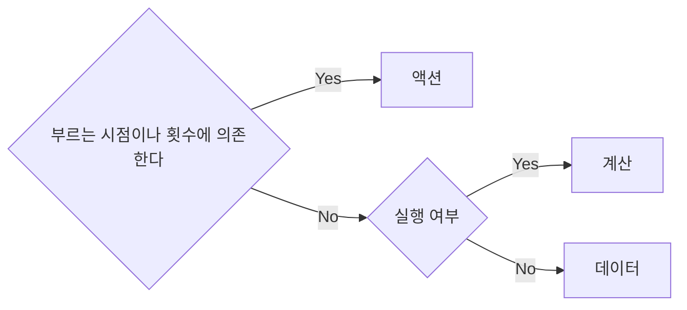

### 함수형 프로그래밍이란?

1. 수학 함수를 사용하고 부수 효과를 피하는 것이 특징인 프로그래밍 패러다임
2. 부수 효과 없이 순수 함수만 사용하는 프로그래밍 스타일

### 함수형 프로그래밍이 부수 효과를 피하려는 이유?

부수 효과란 함수의 리턴값 이외에 하는 모든 일을 의미한다.
어떤 함수에 부수 효과가 있다면 부를 때마다 발생하기 때문에 문제가 될 수 있고
어떤 경우에는 리턴값이 필요해서 불렀지만 의도하지 않게 부수 효과가 발생할 수도 있기 때문에 함수형 프로그래밍에서는 부수 효과를 피하려고 한다.

함수형 프로그래밍은 순수 함수를 지향하는데, 순수 함수란 인자에만 의존하고 부수 효과가 없는 함수를 의미한다.
인자에만 의존한다는 말은 같은 인자를 넣으면 항상 같은 결과를 돌려준다는 말 즉, 동일한 input에는 동일한 output을 준다.

### 실용적인 측면에서 함수형 프로그래밍과 함수형 사고

앞서 말한 정의에 따르면 함수형 프로그래머는 항상 부수 효과를 피하고 순수 함수만 사용해야 할 것 같지만, 실제 함수형 프로그래머는 부수 효과와 순수하지 않은 함수를 사용한다.
현실적인 소프트웨어 개발에서 부수 효과를 완전히 피하는 것은 매우 어렵다. 이메일 보내기 등의 부수 효과가 개발하는 서비스의 핵심 동작 중 하나일 수 있기 때문이다.

즉, 우리는 부수 효과를 피할 수 없기 때문에 부수 효과를 완전히 없애는 게 목표가 아닌 함수형 사고를 통해 부수 효과를 잘 관리하는 방법을 알아야 한다.

### 액션, 계산, 데이터 구분하기

**함수형 프로그래밍에서 코드는 액션, 계산, 데이터로 구분하며,** 일반적으로 액션보다 계산이 쓰기 쉽고 계산보다는 데이터가 쓰기 쉽다.

#### 여러 클라이언트가 작업 완료 표시를 하면 서버에서 이메일을 통해 알려주는 서비스

- 사용자가 작업 완료 표시를 함 -> UI 이벤트이며 실행 횟수에 의존 -> 액션
- 클라이언트가 서버로 메세지를 보냄 -> 액션
  - 메세지 자체는 나중에 서버에서 해석해야 하는 값이므로 데이터
- 서버가 메세지를 받음 -> 횟수에 의존 -> 액션
- 서버가 데이터베이스를 변경 -> 내부 상태 변경 -> 액션
- 서버가 누구에게 알림을 보낼지 결정 -> 입력값이 같다면 서버는 항상 같은 결정을 내림 (인풋이 동일하다면 아웃풋도 동일해야 함) -> 결정하는 것은 계산
- 서버가 이메일로 알림을 보냄 -> 횟수에 의존 -> 액션

#### 1. 액션

> [!NOTE]
> 실행 시점이나 횟수에 의존

- 시간에 지남에 따라 안전하게 상태를 바꿀 수 있는 방법
- 순서를 보장하는 방법
- 액션이 정확히 한 번만 실행되게 보장하는 방법

#### 2. 계산

> [!NOTE]
> 같은 입력값을 가지고 계산하면 항상 같은 결괏값

- 정확성을 위한 정적 분석
- 소프트웨어에서 쓸 수 있는 수학적 지식
- 테스트 전략

#### 3. 데이터

> [!NOTE]
> 이벤트에 대해 기록ㄴ 사실

- 효율적으로 접근하기 위해 데이터를 구성하는 방법
- 데이터를 보관하기 위한 기술
- 데이터를 이용해 중요한 것을 발견하는 원칙

### 액션, 계산, 데이터를 구분하면 어떤 장점이 있나요?

- 코드 안정성, 유지 보수 용이
  - 액션, 계산, 데이터라는 기준으로 코드를 구조화하면 코드가 수행하는 역활이 분산 시스템에도 적용하기 좋다.
  - 또한, 각 부분이 무엇을 하는지 명확하게 구분되기 때문에 문제가 발생했을 때 버그 추적도 좋다.
- 테스트 용이성
  - 동일한 입력에 동일한 결과 -> 예측이 가능하다 -> 즉 테스트 하기 수월해진다!

### 함수형 사고가 무엇인가요?

1. 액션, 계산, 데이터
   - 파트 1에서는 코드를 구분하는 방법, 액션을 계산으로 리팩터링하는 방법, 액션을 더 쉽게 다루는 방법을 소개합니다.
   - 그리고 뒤에서 이렇게 분류한 코드가 설계 관점에서 왜 유지보수와 테스트가 쉽고 재사용성이 좋은지에 대해 알아봅니다.
2. 일급 추상
   - 함수형 프로그래머도 똑같지만 함수에 함수를 넘겨 더 많은 함수를 재사용합니다.
   - 그리고 마지막으로 설계 관점에서 반응형 아키텍처와 어니언 아키텍처를 일급 추상과 연결해서 설명합니다.

### 결론

- ...함수형 사고! 코드를 액션과 계산, 데이터로 구분하는 것부터 시작해보자.
- 액션은 시간에 의존하기 때문에 사용하기 가장 어렵다. 액션에서 시간에 의존하는 부분을 분리하면 다루기 더 쉬워진다.
- 계산은 시간에 의존적이지 않다. 그래서 액션보다 다루기 쉽기 때문에 가능한 코드를 계산으로 바꾸는 것이 좋다.
- 데이터는 저장하거나 이해하기 쉽고 전송하기 편리하다.
