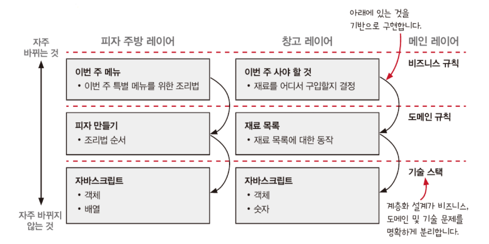
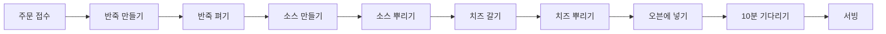
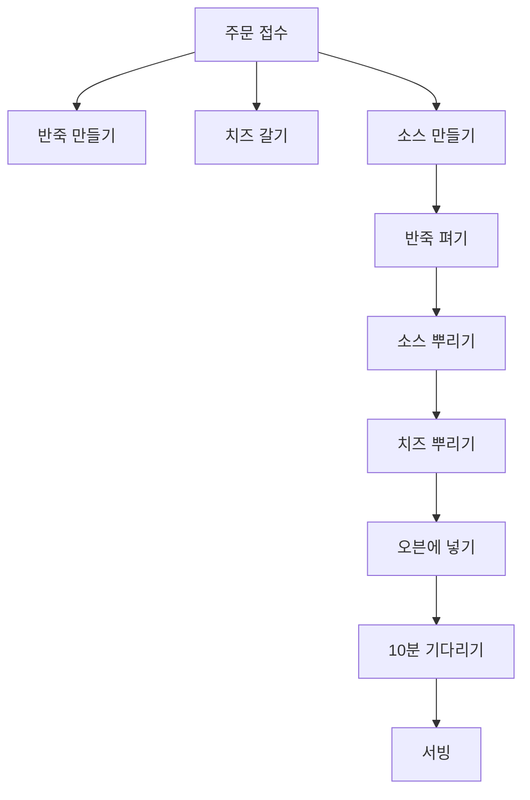
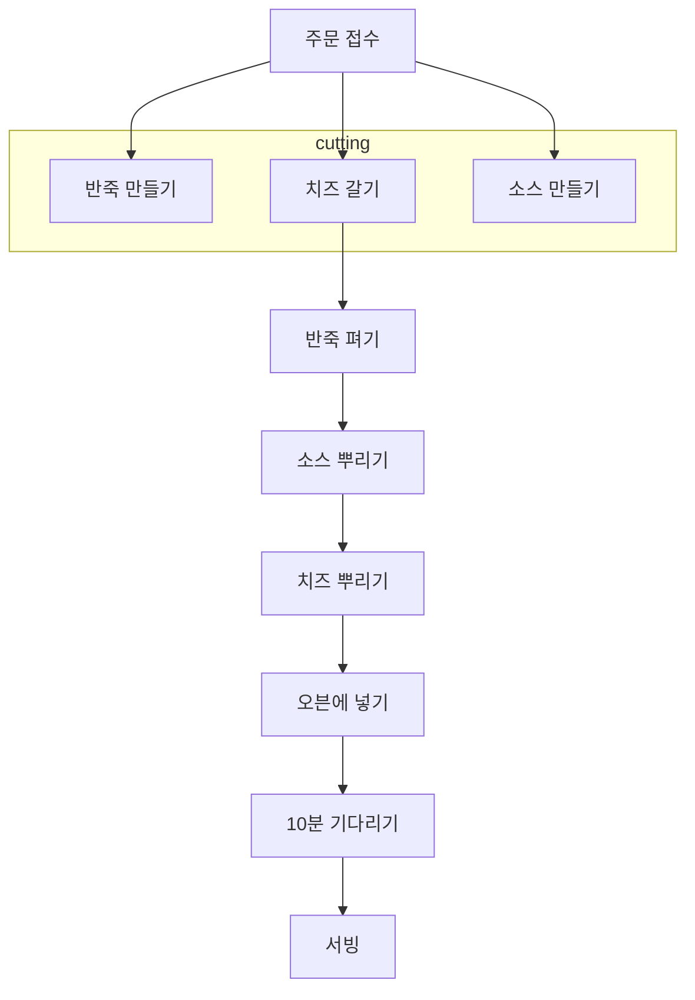

> [!NOTE]
>
> - 액션과 계산, 데이터에 대해 다루면서 구분하는 방법
> - 계층형 설계
> - 타임라인 다이어그램을 그리는 방법
> - 타임라인 커팅

## 액션, 계산, 데이터

1. 액션

- 액션을 호출 횟수와 시점에 의존하는 것
- 사용할 때 조심해야 하며, 자원과 재료를 사용하는 작업
- 예) 반죽 펴기, 피자 배달, 재료 주문

2. 계산

- 어떤 것을 경험하거나 계획하는 것
- 실행해도 다른 곳에 영향을 주지 않는 작업
- 예) 조리법에 나온 것을 두 배로 만들기, 쇼핑 목록 결정

3. 데이터

- 데이터는 유연하기 때문에 저장하거나 네트워크로 전송하는 등 다양하게 사용 가능
- 함수형 프로그래밍에서는 변경 불가능한 데이터를 가능한 한 많이 쓰려고 함
- 예) 결제, 재고, 피자 조리법

## 계층형 설계

> [!NOTE]
> 계층형 설계는 일반적으로 **비즈니스 규칙, 도메인 규칙, 기술 스택** 계층으로 나눈다.

- 변경 가능성에 따라 코드의 계층을 나누어 유지 보수 비용 절감
- 기술 스택 -> 도메인 규칙 -> 비즈니스 규칙
  - 각 계층은 그 아래에 있는 계층을 기반으로 만들어 지고, 각 계층에 있는 코드를 더 안정적인 기반 위에서 작성 가능
  - 위층으로 올라갈 수록 의존성이 거의 없기 때문에 코드 변경 용이
  - 테스트, 재사용, 유지보수 용이

## 분산 시스템을 타임라인으로 시각화하기

### 한 번에 하나씩 처리하는 기존 방법

### 분산 시스템을 이용해보자

- 피자 만드는 작업을 반죽 만들기, 소스 만들기, 치즈 갈기 작업으로 나누고 동시에 처리한다. -> 분산 시스템
- 분산 시스템에서 독립된 액션의 실행 순서는 어떻게 될지 모른다. -> 실행 순서가 섞일 수 있음!
- 기본적으로 각각의 타임라인을 서로 순서를 맞출 수 있는 기능이 없기 때문에 액션 간 실행 순서 보장할 수 없다.
- 타임라인을 서로 맞추지 않은 분산 시스템은 예측 불가능한 순서로 실행된다.

### 분산 시스템에 대해 배운 것

1. 기본적으로 타임라인은 서로 순서를 맞추지 않는다. -> 어떻게 실행 순서를 맞출 수 있을까?
2. 액션이 실행되는 시간은 중요하지 않다. -> 각각의 타임라인은 다른 타임라인의 순서와 관계없이 만들자(타임라인의 독립성 보장)
3. 드물지만 타이밍이 어긋나는 경우는 실제 일어난다. -> 어떻게 하면 항상 올바른 결과를 보장할 수 있는 타임라인을 만들 수 있을까?
4. 타임라인 다이어그램으로 시스템의 문제를 알 수 있다. -> 타임라인 다이어그램으로 시스템을 이해하자

### 타임라인 커팅

- 타임라인 커팅은 **여러 타임라인이 동시에 진행될 때 서로 순서를 맞추는 방법**으로 **고차 동작**으로 구현한다.
- 각 타임라인은 독립적으로 동작하고 작업이 완료되면 다른 타임라인 끝나기를 기다리기 때문에 어떤 타임라인이 먼저 끝나도 괜찮다.
- 즉, 타임라인 커팅은 액션 간 협력을 위해 필요하며, 액션이 올바른 순서로 실행할 수 있도록 보장해 준다.

### 타임라인에 대해 배운 것

1. 타임라인 커팅으로 서로 다른 작업들을 쉽게 이해할 수 있다.
   - 동시에 해야하는 것과 순서대로 해야하는 것의 구분
2. 타임라인 다이어그램을 사용하면 시간에 따라 진행하는 작업을 쉽게 이해할 수 있다.
   - 동시에 실행되는 분산 시스템 시각화 가능
3. 타임라인 다이어그램은 유연하다.
   - 코드 변환이 용이하고 동시에 진행되는 작업을 쉽게 모델링 가능

### 결론

- 유지보수 비용을 줄이기 위해 액션과 계산에 **계층화 설계**를 사용한다.
- **타임라인 다이어그램**을 통해 코드 효율을 높이고 시간에 따라 발생하는 어려운 버그도 고칠 수 있다.
