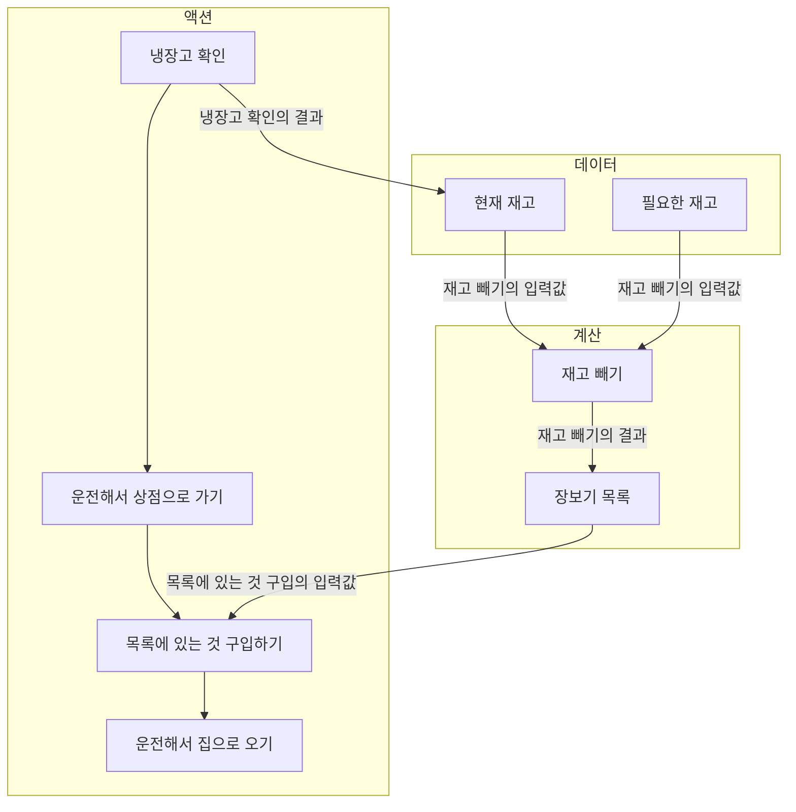

### 액션과 계산, 데이터

- 액션: 실행 시점과 횟수에 의존
- 계산: 입력으로 출력을 계산
- 데이터: 이벤트에 대한 사실

### 액션과 계산, 데이터는 어디에나 적용할 수 있다.


우리가 일상에서 자주 하는 장보기에 액션, 계산, 데이터를 적용해보자.

| 장보기 과정            | A / C / D |
| ---------------------- | :-------: |
| 냉장고 확인하기        |    `A`    |
| 운전해서 상점으로 가기 |    `A`    |
| 필요한 것 구입하기     |    `A`    |
| 운전해서 집으로 오기   |    `A`    |

모든 것이 액션이다!

우리는 액션에 숨어 있는 다른 액션이나 계산 또는 데이터를 발견하기 위해 나눌 수 있는 만큼 나누는 것이 좋다.

구입하는 일도 다른 장보기 과정과 같이 확실히 액션이지만 필요한 것 구입하는 과정은 몇 단계로 나눌 수 있다.
필요한 것을 구입하려면 먼저 필요한 것이 무엇인지 알아야 하고 그 뒤에 필요하지만 없는 제품의 목록을 만들어 볼 수 있다.

```
필요한 재고 - 현재 재고 = 장보기 목록
```

현재 재고 목록과 필요한 재고 목록을 재고 '빼기'라는 계산을 통해 장보기 목록으로 만들 수 있다.
필요한 것을 구입하는 과정을 잘개 쪼개서 액션, 계산, 데이터로 구분한다면 다음과 같다.

| 구입 과정               | A / C / D |
| ----------------------- | :-------: |
| 현재 재고               |    `D`    |
| 필요한 재고             |    `D`    |
| 재고 **빼기**           |    `C`    |
| 장보기 목록             |    `D`    |
| 목록에 있는 것 구입하기 |    `A`    |

타임라인 다이어그램으로 본다면 아래와 같다.



### 장보기 과정에서 배운 것

1. 액션과 계산, 데이터는 어디에나 적용할 수 있다.
2. 액션 안에는 계산과 데이터, 또 다른 액션이 숨어 있을 수 있다.
3. 계산은 더 작은 계산과 데이터로 나누고 연결할 수 있다.
4. 데이터는 데이터만 조합할 수 있다.
5. 계산은 때로 '우리 머릿속에서' 일어난다.
   - 계산이 우리 사고 과정에 녹아있기 때문에 어떤 단계에서 무성르 결정하고 무엇을 계획해야 하는지 생각하는 게 필요하다.

### 데이터에 대해 자세히 알아보기

> [!NOTE]
> 데이터는 **이벤트에 대한 사실**이며, 일어난 일의 결과를 기록한 것이다.

#### 불변성

함수형 프로그래밍에서 불변 데이터 구조를 만들기 위한 두 가지 원칙

- 카피 온 라이트(copy-on-write): 변경할 때 복사본을 생성
- 방어적 복사(defensive copy): 보관하려고 하는 데이터의 복사본을 생성

#### 데이터의 장점

역설적으로 데이터는 데이터 자체로 할 수 있는 것이 없기 때문에 좋다!

- 직렬화
- 동일성 비교
- 자유로운 해석

#### 데이터의 단점

해석하지 않아도 실행 가능한 계산과 달리 데이터는 해석이 반드시 필요하다.

### 새로 만드는 코드에 함수형 사고 적용하기

- 쿠폰에 관심 있는 구독자들에게 이메일로 쿠폰을 매주 보내주는 서비스
- 이메일 DB 테이블과 쿠폰 DB 테이블이 있다.
- 친구를 10명 이상 추천한 사용자에게 더 좋은 쿠폰을 보내주려고 한다.
  - `bad`, `good`, `best`로 3개의 등급이 있지만 `bad` 쿠폰은 사용하지 않는다.

| 코드 작성에 있어서 필요한 단계 적어보기 | A / C / D |
| --------------------------------------- | :-------: |
| 이메일 보내기                           |    `A`    |
| 데이터베이스에서 구독자 가져오기        |    `A`    |
| 쿠폰에 등급 매기기                      |    `D`    |
| 데이터베이스에서 쿠폰 읽기              |    `A`    |
| 이메일 제목                             |    `D`    |
| 이메일 주소                             |    `D`    |
| 추천 수                                 |    `D`    |
| 어떤 이메일이 쿠폰을 받을지 결정하기    |    `C`    |
| 구독자 DB 레코드                        |    `D`    |
| 쿠폰 DB 레코드                          |    `D`    |
| 쿠폰 목록 DB 레코드                     |    `D`    |
| 구독자 목록 DB 레코드                   |    `D`    |
| 이메일 본문                             |    `D`    |

### 쿠폰 보내는 과정을 그려보기

1. 데이터베이스에서 구독자 목록을 가져오기
2. 데이터베이스에서 쿠폰 목록 가져오기
3. 보내야할 이메일 목록 만들기
4. 이메일 전송하기

### 쿠폰 보내는 과정 구현하기

#### 데이터베이스에서 가져온 구독자 데이터

```ts
type Subscriber = {
  email: string
  rec_count: number
}

const subscriber: Subscriber = {
  email: 'sam@pmail.com',
  rec_count: 16,
}
```

#### 쿠폰 등급을 결정하는 함수 (계산)

```ts
type Rank = 'bad' | 'good' | 'best'

const subCouponRank = (subscriber: Subscriber): Rank =>
  subscriber.rec_count >= 10 ? 'best' : 'good'
```

#### 데이터베이스에서 가져온 쿠폰 데이터

```ts
type Coupon = {
  code: string
  rank: Rank
}

const coupon: Coupon = {
  code: 'ILIKEDISCOUNTS',
  rank: 'good',
}
```

#### 특정 등급의 쿠폰 목록을 선택하는 함수 (계산)

```ts
const selectCouponsByRanks = (coupons: Coupon[], rank: Rank): Coupon[] =>
  coupons.filter(coupon => coupon.rank === rank)
```

#### 이메일 데이터

```ts
type Message = {
  from: string
  to: string
  subject: string
  body: string
}

const message: Message = {
  from: 'newsletter@coupondog.co',
  to: 'sam@pmail.com',
  subject: 'Your weekly coupons inside',
  body: 'Here are your coupons ...',
}
```

#### 구독자가 받을 이메일을 계획하는 함수 (계산)

```ts
const emailForSubscriber = (
  subscribers: Subscriber[],
  goods: Coupon[],
  bests: Coupons[],
): Message => {
  const rank = subCouponRank(subscriber)

  return {
    from: 'newsletter@coupondog.co',
    to: subscriber.email,
    subject: `Your ${rank} weekly coupons inside`,
    body: `Here are the ${rank} coupons: ${(rank === 'best' ? bests : goods).join(', ')}`,
  }
}
```

#### 보낼 이메일 목록을 준비하는 함수 (계산)

```ts
const emailsForSubscribers = (subscribers: Subscriber[], goods: Coupon[], bests: Coupons[]) =>
  subscribers.map(subscriber => emailForSubscriber(subscriber, goods, bests))
```

#### 이메일 보내기 (액션)

```ts
const sendIssue = async () => {
  const [coupons, subscribers] = await Promise.all([fetchCouponsFromDB(), fetchSubscribersFromDB()])

  const goodCoupons = selectCouponsByRank(coupons, 'good')
  const bestCoupons = selectCouponsByRank(coupons, 'best')

  const emails = emailsForSubscribers(subscribers, goodCoupons, bestCoupons)
  emails.forEach(email => emailSystem.send(email))
}
```

### 계산에 대해 자세히 알아보기

> [!NOTE]
> 계산은 실행 시점과 횟수에 관계없이 항상 같은 입력값에 대해 같은 출력값을 돌려준다.

#### 액션보다 계산이 좋은 이유

- 테스트하기 쉽다.
- 기계적인 분석이 쉽다.
- 조합하기 좋다.

#### 계산을 쓰면서 걱정하지 않아도 되는 것

- 동시에 실행되는 것
- 과거에 실행되었던 것이나 미래에 실행할 것
- 실행 횟수

#### 계산의 단점

- 실행하기 전에 어떤 일이 발생할 수 없다.

### 이미 있는 코드에 함수형 사고 적용하기

```ts
type Affiliate = {
  sales: number
  commission: number
  bank_code: string
}

const figurePayout = (affiliate: Affiliate) => { // 액션을 호출하고 있으므로 액션
  const owed = affiliate.sales * affiliate.commission
  if (owed > 100) sendPayout(affiliate.bank_code, owed) // 액션
}

const affiliatePayout = (affiliates: Affiliate[]) => { // 액션을 호출하고 있으므로 액션
  affiliates.forEach(affiliate => figurePayout(affiliate)) // 액션
}

const main(affiliates: Affiliate[]) => { // 액션을 호출하고 있으므로 액션
  affiliatePayout(affiliates) // 액션
}
```

### 액션은 코드 전체로 퍼집니다

> [!NOTE]
> 액션을 호출하면 액션이 된다.

- 액션을 부르는 함수가 있다면 그 함수도 액션이 된다. 이런 식으로 작은 액션 하나가 코드 전체로 퍼져 나간다.
- 액션을 찾기 위해서 액션 코드를 모두 찾을 필요는 없고 **코드가 호출 시점이나 횟수에 의존하는지를 생각해보기**
  - 팝업창 띄우기
  - 콘솔 출력
  - `new Date()`
  - 공유되고 변경 가능한 변수

### 액션에 대해 자세히 알아보기

> [!NOTE]
> 액션은 외부 세계에 영향을 주거나 받는 것을 의미하며, 실행 시점과 횟수에 의존한다.

- 언제 실행되는지 - **순서**
- 얼마나 실행되는지 - **반복**

액션은 다루기 어렵지만 소프트웨어를 실행하려는 가장 중요한 이유이므로, 액션을 어떻게 잘 사용할 수 있을지 생각해야 한다.

#### 액션을 잘 사용하기 위한 방법

- 가능한 액션을 적게 사용한다.
- 액션은 가능한 작게 만든다.
- 액션이 외부 세계와 상호작용하는 것을 제한한다.
- 액션이 호출 시점에 의존하는 것을 제한한다.
