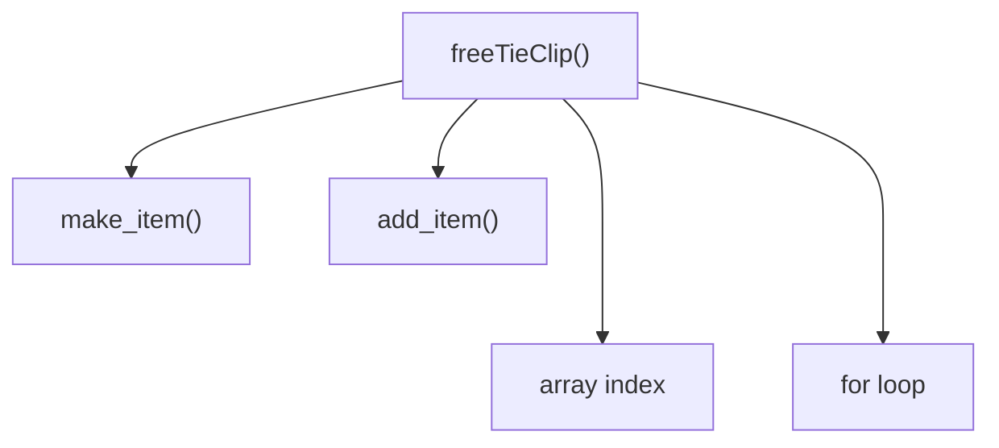
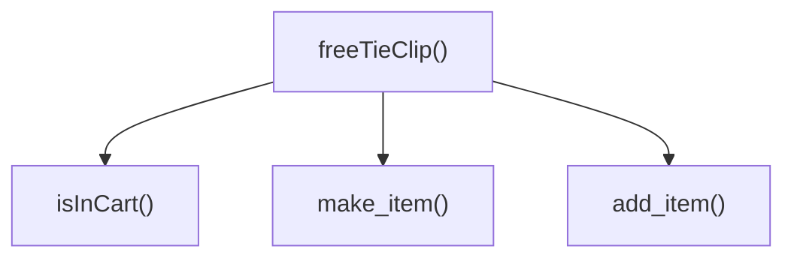
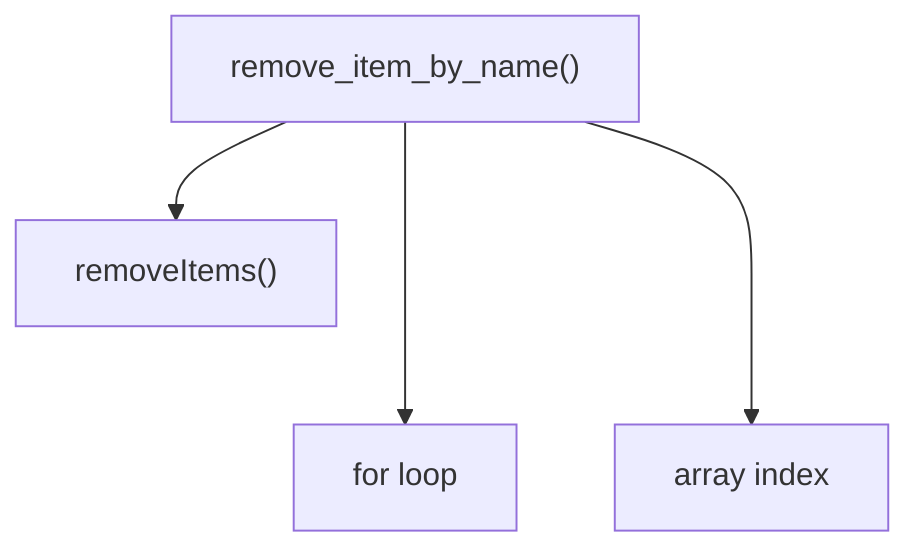
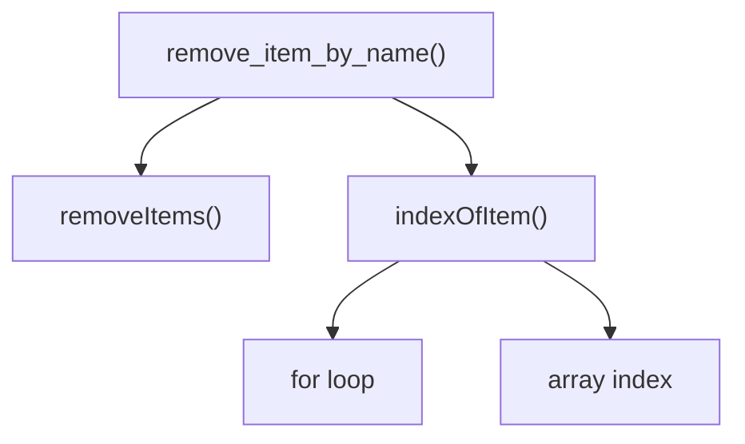

## 소프트웨어 설계란 무엇입니까?

- 코드를 만들고, 테스트하고, 유지보수하기 쉬운 프로그래밍 방법을 선택하기 위해 미적 감각을 사용하는 것

## 계층형 설계란 무엇입니까?

- 소프트웨어를 계층으로 구성하는 기술
- 각 계층에 있는 함수는 바로 아래 계층에 있는 함수를 이용해 정의
- 설계 감각 → 고치고, 읽고, 테스트하고, 재사용하기 쉬운 코드

## 설계 감각을 키우기

- 입력: 함수 본문, 계층 구조, 함수 시그니처
- 출력: 조직화, 구현, 변경

## 계층형 설계 패턴

### 패턴 1: 직접 구현

- 함수 시그니처가 나타내고 있는 문제를 함수 본문에서 적절한 구체화 수준에서 해결해야 한다.
- 너무 구체적이라면 코드에서 나는 냄새라고 볼 수 있다.

### 패턴 2: 추상화 벽

- 중요한 세부 구현을 감추고 인터페이스를 제공한다.
- 고수준의 추상화 단계

### 패턴 3: 작은 인터페이스

- 비즈니스 개념을 나타내는 중요한 인터페이스는 작고 강력한 동작으로 구성하는 것이 좋다.
- 최소한의 인터페이스 유지

### 패턴 4: 편리한 계층

- 소프트웨어를 더 빠르고 고품질로 제공하는 데 도움이 되는 계층에 시간을 투자해야 한다.
- 코드와 그 코드가 속한 추상화 계층은 작업할 때 편리해야 한다.

## 패턴 1: 직접 구현

### 기능은 구현되어 있지만 설계는 없는 코드

```tsx
function freeTieClip(cart) {
  let hasTie = false
  let hasTieClip = false

  for (let i = 0; i < cart.length; i++) {
    const item = cart[i]
    if (item.name === 'tie') hasTie = true
    if (item.name === 'tie clip') hasTieClip = true
  }
  if (hasTie && !hasTieClip) {
    const tieClip = make_item('tie clip', 0)
    return add_item(cart, tieClip)
  }
  return cart
}
```

### 장바구니 설계를 개선하기 위해 장바구니 동작 확인하기

- [x] 제품 추가하기
- [x] 제품 삭제하기
- [ ] 장바구니에 제품이 있는지 확인하기
- [x] 합계 계산하기
- [ ] 장바구니 비우기
- [x] 제품 이름으로 가격 설정하기
- [x] 세금 계산하기
- [x] 무료 배송이 되는지 확인하기

### 장바구니에 제품이 있는지 확인하는 함수로 설계 개선하기

- 장바구니 안에 제품이 있는지 확인하는 함수

```ts
type Cart = Item[]

const isInCart = (cart: Cart, name: string) => cart.filter(item => item.name === name).length > 0
```

- `isInCart()` 함수를 적용해 저수준의 반복문 개선하기

```ts
const freeTieClip = () => {
  const hasTie = isInCart(cart, 'tie')
  const hasTieClip = isInCart(cart, 'tie clip')

  if (hasTie && !hasTieClip) {
    const tieClip = make_item('tie clip', 0)
    return add_item(cart, tieClip)
  }
}
```

### 호출 그래프로 함수 호출을 시각화하기

#### 개선 전 `freeTieClip()` 함수의 호출 그래프

> [!NOTE]
> 직접 만든 함수와 언어 기능이 서로 다른 추상화 단계를 사용하고 있음



#### 개선 후 `freeTieClip()` 함수의 호출 그래프

> [!NOTE]
> 비슷한 추상화 단계 사용



### 직접 구현 패턴을 사용하면 비슷한 추상화 계층에 있는 함수를 호출합니다

> [!NOTE]
> 함수가 모두 비슷한 계층에 있다면 직접 구현했다고 할 수 있다.

- 서로 다른 추상화 단계에 있는 기능을 사용하면 직접 구현 패턴이 아님
- 개선된 함수에서는 장바구니가 배열인지 몰라도 된다!
  - 함수가 모두 비슷한 계층에 있다.

> 직접 구현했다고 볼 수 있는 건 언어 기능 등의 저수준을 추상화했기 때문일까?

### 호출 그래프를 그릴 때 참고사항

아래 항목을 만족한다면 호출 그래프가 조금씩 달라도 괜찮다.

1. 모든 함수가 그래프에 있어야 한다.
2. 함수 안에서 다른 함수를 호출한다면 반드시 표시되어야 한다.
3. 화살표는 옆이나 위가 아닌 아래로 향해야 한다.

### 같은 계층에 있는 함수는 같은 목적을 가져야 합니다

각 계층의 추상화 수준이 다르고, 그래서 어떤 계층에 있는 함수를 읽거나 고칠 때 낮은 수준의 구체적인 내용은 신경 쓰지 않아도 된다. 왜? 그 밑에 있는 계층에서 해줄 거니까.

## 3단계 줌 레벨


### 1. 전역 줌 레벨

- 기본 줌 레벨
- 계층 사이에 상호 관계를 포함해서 모든 문제 영역을 살펴볼 수 있음

### 2. 계층 줌 레벨

- 한 계층과 연결된 바로 아래 계층을 볼 수 있는 줌 레벨
- 계층이 어떻게 구현되어 있는지 알 수 있음

### 3. 함수 줌 레벨

- 함수 하나와 바로 아래 연결된 함수를 볼 수 있는 줌 레벨
- 함수 줌 레벨로 함수 구현의 문제를 찾을 수 있음

## 반복문 빼내기

- 개선 전 코드

```ts
const remove_item_by_name = (cart: Cart, name: string) => {
  let idx = null
  for (let i = 0; i < cart.length; i++) {
    if (cart[i].name === name) idx = i
  }
  if (idx !== null) removeItems(cart, idx, 1)
  return cart
}
```



- 배열 안에 항목에서 조건에 맞는 항목의 인덱스를 찾는 반복문을 함수로 빼내기

```ts
const indexOfItem = (cart: Cart, name: string) => {
  const idx = cart.findIndex(item => item.name === 'name')

  return idx !== -1 ? idx : null
}
```

- `indexOfItem()`함수를 적용해 화살표를 같은 길이로 만들기

```ts
const remove_item_by_name = (cart: Cart, name: string) => {
  const idx = indexOfItem(cart, name)

  if (idx !== null) removeItems(cart, idx, 1)
}
```



## 직접 구현 패턴 리뷰

- 직접 구현한 코드는 한 단계의 구체화 수준에 관한 문제만 해결한다.
- 좋은 설계를 고민하지 않고 만든 코드는 읽거나 고치기 어렵다. → 서로 다른 구체화 단계에 있기 때문
- 직접 구현하면 코드를 읽기 위해 알아야 하는 구체화 단계의 범위를 줄일 수 있다.
- 계층형 설계는 특정 구체화 단계에 집중할 수 있게 도와준다. → 설계 감각
- 호출 그래프는 구체화 단계에 대한 풍부한 단서를 보여준다.
  - 함수가 서로 어떻게 연결되어 있는지
  - 함수 시그니처와 본문, 호출 그래프 등의 다양한 단서
- 함수를 추출하면 더 일반적인 함수로 만들 수 있다.
  - 명확한 코드와 알맞은 이름을 가진 함수
  - 테스트 용이
- 일반적인 함수가 많을수록 재사용하기 좋다.
  - 중복 코드를 찾기 위해 함수를 빼는 것과는 다름
  - 구현을 명확하기 위해 일반적인 함수를 빼내는 것
- 복잡성을 감추지 않는다.
  - 헬퍼 함수 → 계층형 설계가 아님
  - 계층형 설계에서 모든 계층은 바로 아래 계층에 의존해야 함
  - 더 낮은 구체화 수준을 가진 일반적인 함수를 만들어 소프트웨어에 직접 구현 패턴을 적용해야 함
