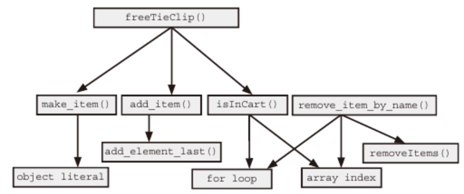
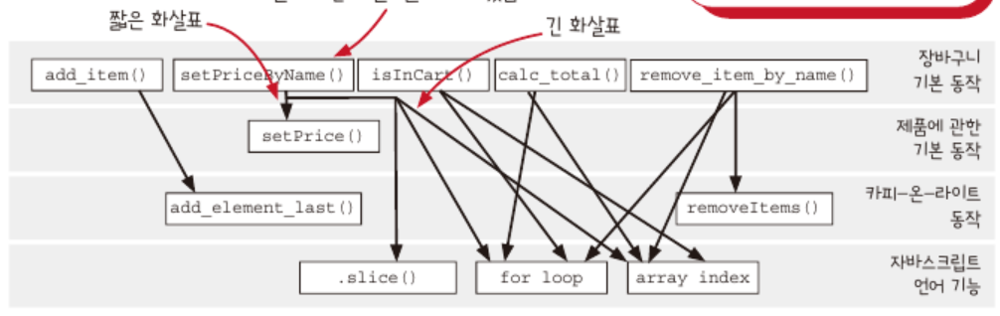
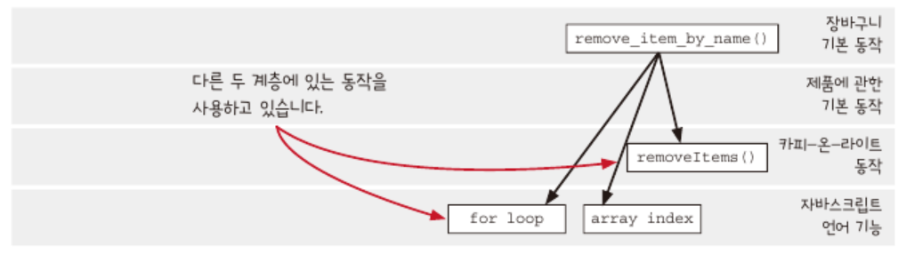
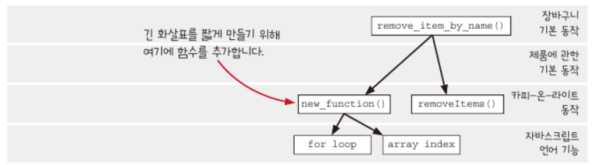

## 계층형 설계 1

**지금까지 작업한 코드에 `계층형 설계`라는 설계 방법 적용해보기**

### 소프트웨어 설계란?

**코드를 만들고, 테스트하고, 유지보수하기 쉬운 프로그래밍 방법을 선택하기 위해 미적 감각을 사용하는 것**

설계가 잘 되어 있다면 소프트웨어 개발 과정 전체에 도움이 된다. 아이디어를 코드로 구현하고 테스트 및 유지보수하기 쉽다. (매우 공감 🙆)

### 계층형 설계란?

**소프트웨어를 계층으로 구성하는 기술로써, 오랜 역사가 있는 기술**

지금까지 작성한 코드를 계층으로 나눠보자면

- 비즈니스 규칙
  - `gets_free_shipping()`
  - `cartTax()`
- 장바구니를 위한 동작들
  - `remove_item_by_name()`
  - `calc_total()`
  - `add_item()`
  - `setPriceByname()`
- 카피-온-라이트
  - `removeItems()`
  - `add_element_last()`
- 언어에서 지원하는 배열 관련 기능
  - `.slice()`

위처럼 나누기가 쉽지 않다. 좋은 설계 감각을 키우기 위해서 코드를 읽을 때 더 좋은 설계를 알려주는 신호를 찾는 법을 배워보자!

### 설계 감각 키우기(🧨 이해하기 어려운 내용이다 🧨)

1. **계층형 설계 감각을 키우기 위한 입력**

- 함수 본문: 길이, 복잡성, 구체화 단계, 함수 호출, 프로그래밍 언어의 기능 사용
- 계층 구조: 화살표 길이, 응집도, 구체화 단계
- 함수 시그니처: 함수명, 인자 이름, 인잣값, 리턴값

2. **계층형 설계 감각을 키우기 위한 출력**

- 조직화
  - 새로운 함수를 어디에 놓을지 결정
  - 함수를 다른 곳으로 이동
- 구현
  - 구현 바꾸기
  - 함수 추출하기
  - 데이터 구조 바꾸기
- 변경
  - 새 코드를 작성할 곳 선택하기
  - 적절한 수준의 구체화 단계 결정하기

### 계층형 설계 패턴에서 중요한 4가지

1. 직접 구현

직접 구현은 계층형 설계 구조를 만드는 데 도움이 된다. 함수 시그니처가 나타내고 있는 문제를 함수 본문에서 적절한 구체화 수준에서 해결해야 한다. (💡내가 해석하기엔, 함수 본문이 너무 구체화되어서 관심 사항에서 벗어나는 구현까지 수행한다면 안 좋은 코드라고 얘기하는 것 같다.💡)

2. 추상화 벽

호출 그래프에 어떤 계층은 중요한 세부 구현을 감추고 인터페이스를 제공한다. 인터페이스를 사용하면 고수준의 추상화 단계만 생각하면 돼서 두뇌 용량이 한계를 극복할 수 있다. (💡 내가 해석하기엔, 모든 세부 구현을 한 코드에 몰아 넣어서 이해하거나 사용하기 어렵게 하지 않고 감춘다는 말인 것 같다.💡)

3. 작은 인터페이스

시스템이 커질수록 비즈니스 개념을 나타내는 중요한 인터페이스는 작고 강력한 동작으로 구성하는 것이 좋다. (💡 내가 해석하기엔, 인터페이스로 제공되어서 상위 계층에서는 보이지 않는다고 해서 중요하지 않은 것이 절대 아니다. 비즈니스 개념을 담고 있기에 더욱 잘 동작해야 상위 계층이 올바르게 동작할 수 있다고 생각한다.💡)

4. 편리한 계층

계층형 설계 패턴과 실천 방법은 개발자의 요구를 만족시키면서 비즈니스 문제를 잘 풀 수 있어야 한다. 또한, 코드와 그 코드가 소한 추상화 계층은 작업할 때 편리해야 한다. (💡결국, 이 모든 설계와 패턴은 요구 사항을 충족하고자 함에 있다고 생각한다.💡)

### 패턴 1: 직접 구현

```ts
// 넥타이 하나를 사면 무료로 넥타이 클립을 하나 주는 코드
function freeTieClip(cart) {
  let hasTie = false;
  let hasTieClip = false;
  for (let i = 0; i < cart.length; i++) {
    const item = cart[i];
    if (item.name === "tie") hasTie = true;
    if (item.name === "tie clip") hasTieClip = true;
  }
  if (hasTie && !hasTieClip) {
    const tieClip = make_item("tie clip", 0);
    return add_item(cart, tieClip);
  }
  return cart;
}
```

> [!WARNING]
> 하지만 예시 코드는 제대로 설계하지 않고 그냥 기능을 추가한 것이다. 또한, 계층형 설계 패턴인 `직접 구현`을 따르지 않고 있는데, freeTieClip() 함수가 알 필요가 없는 구체적인 내용을 담고 있다. (ex. 마케팅 캠페인과 관련된 함수가 장바구니가 배열이라는 사실을 알 필요가 없음)

freeTieClip() 함수에 넥타이 제품이 있는지 확인하는 함수를 적용해서 직접 구현 패턴을 적용해보자면,

```ts
function freeTieClip(cart) {
  const hasTie = isInCart(cart, "tie");
  const hasTieClip = isInCart(cart, "tie clip");

  if (hasTie && !hasTieClip) {
    const tieClip = make_item("tie clip", 0);
    return add_item(cart, tieClip);
  }
}

// 서브 루틴 추출하기
// 제품이 장바구니 안에 있는지 확인하는 함수는 장바구니가 배열이라는 사실을 알 필요가 있다.
function isInCart(cart, name) {
  for (let i = 0; i < cart.length; i++) {
    const item = cart[i];
    if (item.name === name) return true;
  }
  return false;
}
```

저수준의 반복문을 직접 쓰지 않고 추출함으로써 원래 freeTieClip 함수에서 다른 제품 두 개가 있는지 확인하는 중복 코드를 제거할 수 있다. 개선한 함수는 짧고 명확한 데다가, 모두 비슷한 구체화 수준에서 작동하고 있다!

### 호출 그래프를 만들어 함수 호출을 시각화하기

`freeTieClip()` 함수를 또 다른 관점에서 보자면, 함수에서 사용하는 다른 함수와 언어 기능으로 호출 그래프를 그릴 수 있다.

| 추상화 단계의 높낮이 | 함수나 기능                         |
| -------------------- | ----------------------------------- |
| 상                   | freeTieClip()                       |
| 중                   | make_item(), add_item() - 만든 함수 |
| 하                   | array_index, for loop - 언어 기능   |

### 직접 구현 패턴을 사용하면 비슷한 추상화 계층에 있는 함수를 호출한다

freeTieClip() 함수에 직접 구현 패턴을 적용하지 않았을 때는 호출 다이어그램에 여러 추상화 계층이 보인다.

하지만 isInCart() 함수를 만들어서 언어 기능을 추상화하면서 '중'단계에 있던 만든 함수와 추상화 수준이 비슷해지고 다이어그램에는 비슷한 추상화 단계를 쓸 수 있게 된다!

| 추상화 단계의 높낮이 | 함수나 기능                                     |
| -------------------- | ----------------------------------------------- |
| 상                   | freeTieClip()                                   |
| 중                   | make_item(), add_item(), isInCart() - 만든 함수 |

### 쉬는 시간

Q. 호출 그래프가 정말 필요한가? 그냥 코드를 봐도 문제를 알 수 있는 것 같다.

- 더 많은 계층이 생기는 경우 전체적으로 보는 데 도움을 줄 수 있고 계층 구조를 보는 것만으로도 설계 감각을 키우는 데 도움이 된다.

Q. 앞에서 그린 계층이 정답인지? 모두가 동의할 수 있는 객관적인 것인지?

- 계층형 설계는 각자의 관점으로 사람들이 사용하면서 습득한 것이므로 다른 사람이 만든 계층도 보면 도움이 된다.

### remove_item_by_name() 함수 그래프 그려보기

freeTieClip() 함수의 호출 그래프에 remove_item_by_name() 함수를 계층으로 나누어 같이 그려보자.

```ts
function remove_item_by_name(cart, name) {
  let idx = null;
  for (let i = 0; i < cart.length; i++) {
    if (cart[i].name === name) idx = i;
  }
  if (idx !== null) return removeItems(cart, idx, 1);
  return cart;
}
```

`remove_item_by_name()` 함수는 언어 기능(array index, for loop)과 만든 함수(removeItems)로 나눌 수 있다.

> [!NOTE]
> freeTieClip()을 계층화하면서 두 계층으로 나눴으므로, 그 두 계층에다가 1. 더 높은 계층, 2. 그 사이의 계층, 3. 제일 아래 계층을 추가할 수 있다. 총 5개의 계층을 마련했으므로 어떤 계층에 remove_item_by_name() 함수와 그 하위 계층을 놓을 수 있을지 고민해보자.

결과는 다음과 같다.



총 5개의 계층을 하나씩 살펴보자면,

1. 가장 높은 곳의 계층

freeTieClip() 함수는 마케팅 캠페인에 관련된 이름과 동작을 갖고 있지만 remove_item_by_name() 함수 이름과 동작은 마케팅과 관련이 없다. 결국 ❌

2. freeTieClip()과 같은 계층

1번과 같은 이유로 ❌

3. 사이에 계층

여기도 괜찮지만, 장바구니와 제품을 다루는 계층이 적합해보인다. ⚠️

4. make_item(), add_item(), isInCart()과 같은 계층

장바구니와 제품을 다루는 이름을 가진 함수들이라서, 괜찮은 위치이다. 또한 isInCart()와 remove_item_by_name()은 같은 언어 기능을 하위 계층으로 두고 있으므로 적합하다. ✅

5. 제일 하위 계층

가장 낮은 계층에서 remove_item_by_name()을 호출할 일은 없다. 결국 ❌

### 같은 계층에 있는 함수는 같은 목적을 가져야 한다

5개의 계층으로 나누어 remove_item_by_name()이 위치할 만한 계층을 찾긴 했지만, 각 계층이 명확한 목적을 가지고 있다면 함수가 위치할 계층을 선택하는 데 좋은 정보로 사용할 수 있다.

---

### 문제는 어떻게 찾지? - 3단계 줌 레벨

호출 다이어그램에는 너무 많은 정보가 있어서 어느 곳에 문제가 있는지 찾기 어렵다. 계층형 설계에서 문제는 세 가지 다른 영역에서 찾을 수 있다.

1. **전역 줌 레벨**

전역 줌 레벨로 그래프 전체 중 필요한 부분을 살펴볼 수 있고 계층 사이의 상호 관계를 포함해서 모든 문제 영역을 볼 수 있다.

2. **계층 줌 레벨**

한 계층과 연결된 바로 아래 계층을 볼 수 있다. 장바구니 기본 동작 계층을 살펴본다면,



**직접 구현 패턴**을 사용한다면 모든 화살표가 같은 길이를 가져야 하는데 위 다이어그램은 그렇지 않고 🧨 서로 다른 구체화 수준을 갖고 있다. 🧨

3. **함수 줌 레벨**

함수 하나와 바로 아래 연결된 함수들을 볼 수 있고 함수 구현의 문제를 찾을 수 있다. 계층 줌 레벨에서 문제를 찾았으니 함수 줌 레벨로 살펴보면,



remove_item_by_name()은 서로 다른 계층의 함수나 기능을 사용하고 있다. 화살표 길이를 같게 하기 위해서 반복문을 뺴내서 중간에 함수를 두는 방법을 사용한다.



### 직접 구현 패턴 리뷰

1. 직접 구현한 코드는 한 단계의 구체화 수준에 관한 문제만 해결한다.
2. 계층형 설계는 구체화 단계에 집중할 수 있게 도와준다.
3. 호출 그래프는 구체화 단계에 대한 풍부한 단서를 보여준다.
4. 함수를 추출하면 더 일반적인 함수로 만들 수 있다.
5. **일반적인 함수가 많을수록 재사용하기 좋다.**
6. 복잡성을 감추지 않는다.
   - 직접 구현 패턴을 적용한 코드처럼 보이게 만드는 것은 서브 루틴을 추출하기만 하면 되므로 쉽다. 하지만 이는 계층형 설계가 아니다! 계층형 설계에서 모든 계층은 바로 아래 계층에 의존해야 하고 복잡한 계층을 한 계층에 몰아넣으면 안된다.

### 느낀 점

- 의미론적으로 큰 숲을 보는 것과 같은 **설계**를 하기란 쉽지 않지만, 복잡한 요구사항을 가진 문제를 해결하거나 컴포넌트를 개발할 때 설계가 중요하다고 생각한 적이 몇 번 있다.
- 개인적인 의견으로는 계층형 설계가 완벽히 이뤄진 상태로 코드를 짜는 것은 불가능하다고 생각하는데, 합성 컴포넌트 패턴을 적용해서 자유도가 높은(내부에서 순서가 바뀔 수 있는) 컴포넌트를 개발할 때 하위 컴포넌트끼리 비슷한 수준을 갖길 바라면서 코드를 작성한 적이 있는데, 계속 고쳐나간 끝에 원하는 결과를 얻었기 때문이다.
- 그럼에도 불구하고, 이러한 설계를 미리 고민해볼 수 있는 역량을 키우는 것이 **읽기 좋은 코드를 빨리 작성할 수 있는 데 엄청난 도움이 되겠다는 생각**이 든다.
- 직접 구현 패턴에서 핵심은 **일반적인 함수(계산)를 만들어서 하위 계층에 두는 것**이라고 생각한다.
