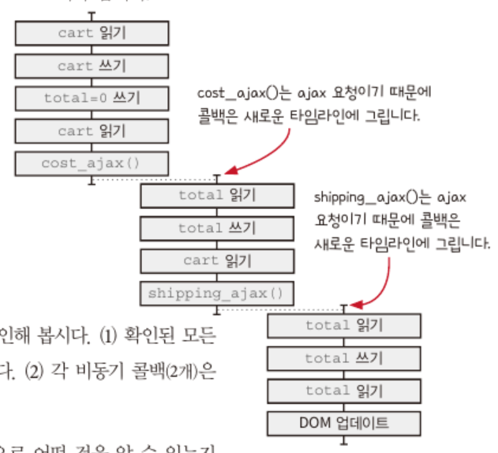
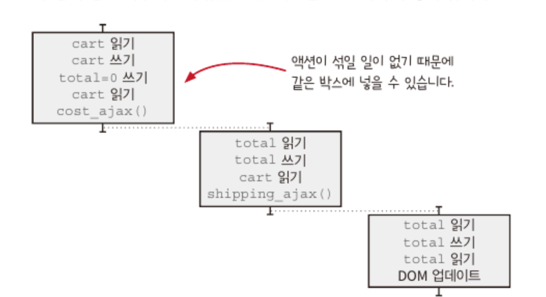
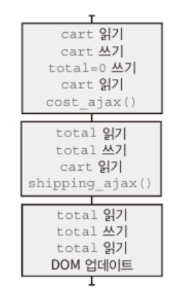
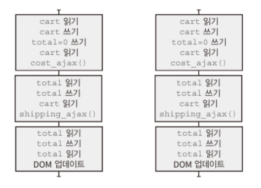
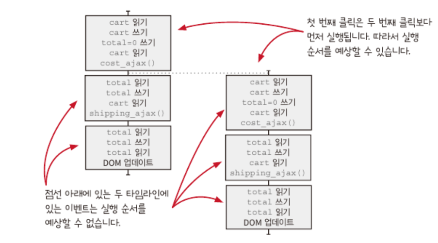
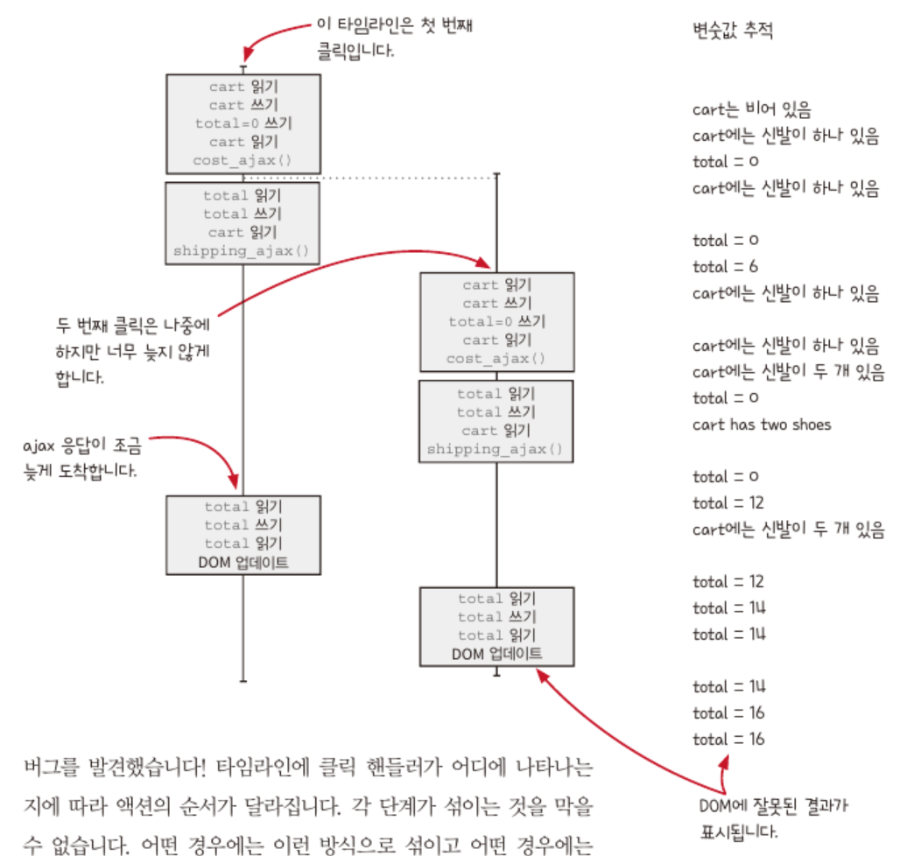

## 15장. 타임라인 격리하기

천천히 클릭하면 문제가 생기지 않지만, **빠르게 누르면 장바구니에서 합계 금액이 잘못 표시된다는 문제**를 발견했다.

버튼 속도에 따라 생기는 버그를 이해해보자.

사려고 하는 물품의 가격이 6달러이고 배송비가 2달러일 떄, 빠르게 구매 버튼을 두 번 누르면 14달러가 화면에 보여야 하는 것이 맞지만, 여러 번 해보면 16달러❌가 나오기도 22달러❌가 나오기도 한다.

```ts
// 사용자가 장바구니에 추가 버튼을 클릭할 때 실행되는 함수
function add_item_to_cart(name, price, quantity) {
  cart = add_item(cart, name, price, quantity);
  calc_cart_total();
}

function calc_cart_total() {
  total = 0;
  cost_ajax(cart, function (cost) {
    // 제품 API로 AJAX 요청을 보내고 완료될 때 실행되는 콜백
    total += cost;
    shipping_ajax(cart, function (shippping) {
      // 판매 API로 AJAX 요청 보내고, 응답이 오면 실행되는 콜백
      total += shipping;
      update_total_dom(total); // 합계를 DOM에 보여줌
    });
  });
}
```

사실 장바구니에 제품을 추가하고 다음 제품을 추가할 때까지 기다리면 시스템은 올바르게 동작하지만, 그렇지 않기 때문에 문제가 발생하고 있다.

> 시간에 따른 액션 순서를 시각적으로표시한 타임라인 다이어그램을 그린다면, 각 액션이 서로 어떻게 상호작용하고 간섭하는지 볼 수 있어서 이런 종류의 버그를 줄일 수 있다!

### 두 가지 타임라인 다이어그램 기본 규칙

1. 두 액션이 순서대로 나타나면 같은 타임라인에 넣습니다.

```ts
sendEmail1();
sendEmail2();
```

이 두 액션은 한 액션 다음에 다른 액션이 오므로 같은 타임라인에 넣습니다. 계산은 실행 시점에 영향을 받지 않으므로 그리지 않습니다.

2. 두 액션이 동시에 실행되거나 순서를 예상할 수 없다면 분리된 타임라인에 넣습니다.

```ts
setTimeout(sendEmail1, Math.random() * 10000);
setTimeout(sendEmail2, Math.random() * 10000);
```

**서로 다른 스레드나 프로세스, 기계, 비동기 콜백에서 실행되면 서로 다른 타임라인에 표시합니다.** 이 경우는 액션 두개가 서로 다른 비동기 콜백에서 실행되고, 액션의 실행 시점이 무작위여서 어떤 액션이 먼저 실행될지 알 수 없습니다.

### 자세히 보면 놓칠 수 있는 액션 순서에 관한 두 가지 사실

1. ++와 +=는 사실 세 단계입니다.

```ts
let temp = total; // 읽기(액션)
temp = temp + 1; // 더하기(계산)
total = temp; // 쓰기(액션)
```

실행 시점에 영향을 받지 않는 계산을 제외하고는 읽기와 쓰기 액션은 한 다이어그램에 표시해야 한다.

2. 인자는 함수를 부르기 전에 실행합니다.

```ts
// 전역변수를 읽어(액션) 값을 로깅하는(액션) 코드
console.log(total);
```

즉, 읽는 액션과 로깅 액션을 한 다이어그램에 표시해야 한다.

### add-to-cart 타임라인 그리기: 단계 1

1. 액션을 확인합니다.

```ts
function add_item_to_cart(name, price, quantity) {
  cart = add_item(cart, name, price, quantity); // 1. cart 읽기, 2. cart 쓰기
  calc_cart_total();
}

function calc_cart_total() {
  total = 0; // 3. total = 0 쓰기
  cost_ajax(cart, function (cost) {
    // 4. cart 읽기, 5. cost_ajax() 부르기
    total += cost; // 6. total 읽기, 7. total 쓰기
    shipping_ajax(cart, function (shippping) {
      // 8. cart 읽기, 9. shipping_ajax() 부르기
      total += shipping; // 10. total 읽기, 11. total 쓰기
      update_total_dom(total); // 12. total 읽기, 13. update_total_dom() 부르기
    });
  });
}
```

### 서로 다른 언어, 서로 다른 스레드 모델

**단일 스레드, 동기**

- 기본적으로 멀티스레드를 지원하지 않는 PHP같은 언어가 있다.
- 모든 것이 순서대로 실행되고 입출력을 사용하면 끝날 때까지 기다려야 한다.
- 시스템이 단순하다.
- 네트워크를 통한 API 호출 같은 경우를 제외하곤, 스레드가 하나면 타임라인도 하나다.
- 메모리를 공유하지 않기 때문에 공유 자원이 거의 없다.

**단일 스레드, 비동기**

- 자바스크립트는 단일 스레드
- 입출력 작업을 하려면 비동기 모델을 사용해야 한다.
- 입출력의 결과를 콜백으로 받을 수 있지만, 언제 끝날지 알 수 없어서 다른 타임라인에 표현해야 한다.

**멀티스레드**

- 자바, 파이썬, 루비, C, C#과 같은 많은 언어가 멀티스레드를 지원
- 멀티스레드는 실행 순서를 보장하지 않기 때문에 프로그래밍하기가 매우 어렵다.
- 새로운 스레드가 생기면 새로운 타임라인을 그려야 한다.

**메시지 패싱 프로세스**

- 엘릭서나 얼랭 같은 언어는 서로 다른 프로세스를 동시에 실행할 수 있는 스레드 모델을 지원
- 프로세스는 서로 메모리를 공유하지 않고 메시지로 통신
- 서로 다른 타임라인에 있는 액션은 순서가 섞이지만, 메모리를 공유하지 않아서 문제가 되지 않는다.

### add-to-cart 타임라인 그리기: 단계 2

2. 순서대로 실행되거나 동시에 실행되는 액션을 그립니다.



ajax 요청이 일어나는 두 군데에서 새로운 타임라인이 각각 생성된다.

### 타임라인 다이어그램으로 순서대로 실행되는 코드에도 두 가지 종류가 있다는 것을 알 수 있습니다

1. 순서가 섞일 수 있는 코드

한 다이어그램 안에 두 액션 사이에 시간은 얼마나 걸릴지 알 수 없습니다. 선이 길어지거나 짧아진다고 해도 시간은 파악할 수 없습니다.

2. 순서가 섞이지 않는 코드

두 액션이 차례로 실행되는데 그 사이에 다른 작업이 끼어들지 못합니다. 이런 경우는 여러 액션을 같은 상자에 그립니다.

> [!NOTE]
> 짧은 타임라인이 관리하기 쉬우므로, 박스가 적은 것이 더 좋다👍

### 타임라인 다이어그램으로 동시에 실행되는 코드는 순서를 예측할 수 없다는 것을 알 수 있습니다

타임라인 다이어그램에서 정렬된 위치가 같다고 하더라도 항상 정확히 동시에 실행된다는 의미가 아니다.

### 좋은 타임라인의 원칙

1. 타임라인은 적을수록 이해하기 쉽습니다.
2. 타임라인은 짧을수록 이해하기 쉽습니다.
3. 공유하는 자원이 적을수록 이해하기 쉽습니다. - 두 액션이 서로 자원을 공유하지 않는다면 실행 순서에 신경 쓸 필요가 없다.
4. 자원을 공유한다면 서로 조율해야 합니다.
5. 시간을 일급으로 다룹니다.

### 자바스크립트의 단일 스레드

```java
int x = 0;
public void addToX(int y) {
    x += y;
}
```

자바 스레드 모델(멀티스레드)의 경우 두 스레드가 변수를 공유할 때, += 연산자는 실제로 세 단계로 실행된다.

1. 현재 값을 읽습니다.
2. 그 값에 숫자를 더합니다.
3. 새 값을 다시 저장합니다.

그렇기 때문에, 두 스레드가 `addToX()`를 동시에 실행한다면 실행 순서가 섞여서 여러가지 결과가 나오지만, 단일 스레드인 자바스크립트는 그럴 일이 없다.

하지만, 🚨비동기 콜백을 함께 사용한다면 문제가 생길 수 있으므로 자바스크립트에서 어떤 동작이 동기인지 비동기인지 아는 것은 중요하다.🚨

### 자바스크립트의 비동기 큐

브라우저에서 동작하는 자바스크립트 엔진은 **작업 큐**(태스크 큐라고 기억하고 있다...!)라고 하는 큐를 가지고 있다.

작업 큐는 **이벤트 루프**에 의해 처리되는데, 큐에서 작업 하나를 꺼내 실행하고 완료되면 다음 작업을 꺼내 실행하는 것을 무한히 반복한다.

> 작업이란 이벤트 데이터와 이벤트를 처리할 콜백으로 구성되어 있다. 마우스 클릭이나 키보드 입력, AJAX 이벤트가 일어났을 때 큐에 작업이 추가된다. 처리할 작업이 없는 경우, 이벤트 루프는 대기 상태로 들어가서 전원을 아끼거나 가비지 컬렉션 같은 관리 작업을 하기도 한다.

### AJAX와 이벤트 큐

AJAX는 브라우저에 기반을 둔 웹 요청이고, 실제로는 XML을 사용하지 않지만, 용어는 그대로 남아 쓰고 있다.

자바스크립트에서 AJAX 요청을 만들면 네트워크 엔진이 AJAX 요청을 처리하기 위해 요청 큐에 넣는다. **이 때 중요한 것은 요청이 완료될 때까지 기다릴 필요가 없이 코드는 계속 실행된다.** 즉, AJAX를 사용하는 부분은 비동기이다.

### add-to-cart 타임라인 단순화하기: 단계 3

마지막 단계는 또 작은 여러 단계로 나눠진다.

1. 하나의 타임라인에 있는 모든 액션을 하나로 통합합니다.

자바스크립트는 하나의 스레드에서 모든 코드를 실행하므로, 현재 타임라인에 다른 스레드가 끼어들지 않는다. 따라서 타임라인에 있는 액션이 서로 섞일 가능성이 없으므로 같은 타임라인에 있다면 하나의 박스에 넣을 수 있다.



2. 타임라인이 끝나는 곳에서 새로운 타임라인이 하나 생긴다면 통합합니다.

이전 단계를 거친 다이어그램에 있는 타임라인은 새로운 타임라인이 시작하면 끝나므로 모든 타임라인을 하나의 타임라인으로 합칠 수 있다.



🚨그렇다고 해서 첫 번째 단계를 다시 적용해서 모든 액션을 하나의 박스로 넣을 수는 없다.🚨 만약 다른 타임라인에 액션이 생긴다면 각 박스는 순서가 섞일 가능성이 있기 때문이다.

---

### 요약: 타임라인 다이어그램 그리기

- **액션을 확인하기**: ++이나 += 같은 연산자에 숨어 있는 액션들을 찾으면서, 모든 액션을 뽑아내는 것이 중요하다.
- **액션을 그리기**: 순서대로 실행되면 같은 같은 타임라인에, 동시에 실행되거나 서로 언제 실행될지 모르는 경우는 다른 타임라인에 나타낸다.
- **타임라인을 단순화하기**: 언어의 특징을 사용해서 순서가 섞이지 않는 두 액션은 같은 박스로 묶는다거나 타임라인 여러 개를 하나로 합칠 수도 있다.
- **타임라인 읽기**: 항상 세 가지 순서로 실행될 수 있음을 고려한다. 동시 실행이거나 왼쪽이 먼저 되거나 오른쪽 액션이 먼저 실행되는 경우가 있다.

### 타임라인을 나란히 보면 문제가 보입니다

다시 돌아와서, 장바구니에 제품을 담기 위해 두 번 클릭했을 때 나는 버그를 확인하기 위해 타임라인을 나란히 놓고 보자.



다이어그램을 조금 조정해볼 수 있는데, 두 번째 타임라인은 첫 번째 타임라인의 첫 단계가 실행되기 때문에 점선을 추가해서 실행 시점을 조정해볼 수 있다.



이 때 두 번 천천히 클릭하면 문제가 없다는 사실을 충분히 알 수 있는데, 첫 번째 타임라인의 세 번째 단계가 끝나고 나서 두 번째 타임라인이 시작된다면 다음과 같은 논리대로 장바구니의 물품 가격이 계산 된다.

```text
// 첫 번째 타임라인
1. cart 읽기 : cart는 비어 있음
2. cart 쓰기 : cart에 신발 하나를 담았음
3. total = 0 쓰기 : total = 0
4. cart 읽기 : cart에 신발 하나가 있음
5. cost_ajax()

6. total 읽기 : total = 0
7. total 쓰기 : total = 6(신발 가격)
8. cart 읽기 : cart에 신발 하나가 있음
9. shipping_ajax()

10. total 읽기 : total = 6
11. total 쓰기 : total = 8(배송비)
12. total 읽기 : total = 8
13. DOM 업데이트

// 두 번째 타임라인
1. cart 읽기 : cart에 신발이 하나 있음
2. cart 쓰기 : cart에 신발 하나를 더 담아서 두 개가 있음
3. total = 0 쓰기 : total = 0
4. cart 읽기 : cart에 신발이 두 개 있음
5. cost_ajax()

6. total 읽기 : total = 0
7. total 쓰기 : total = 12(신발 가격)
8. cart 읽기 : cart에 신발이 두 개 있음
9. shipping_ajax()

10. total 읽기 : total = 12
11. total 쓰기 : total = 14(배송비)
12. total 읽기 : total = 14 -> 올바른 결과가 나왔다.
13. DOM 업데이트
```

### 빠르게 두 번 클릭하면 잘못된 결과가 나옵니다



두 타임라인의 순서가 섞이면서 배송비가 두 번 더해지는 문제가 발생했기 때문에, 14달러가 아닌 16달러라는 결과를 얻게 됐다.

### 전역변수를 지역변수로 바꾸기, 전역변수를 인자로 바꾸기

문제는 **공유하는 자원** 때문에 발생한다. 두 타임라인 모두 같은 전역변수를 사용하고 있다!

```ts
function add_item_to_cart(name, price, quantity) {
  cart = add_item(cart, name, price, quantity); // cart는 전역 변수
  calc_cart_total();
}

function calc_cart_total() {
  total = 0; // total은 전역 변수
  cost_ajax(cart, function (cost) {
    total += cost;
    shipping_ajax(cart, function (shippping) {
      total += shipping;
      update_total_dom(total);
    });
  });
}
```

`total`은 전역변수가 아니어도 되므로 지역변수로 변경한다.

```ts
function calc_cart_total() {
  let total = 0; // 지역 변수로 바꾸기
  cost_ajax(cart, function (cost) {
    total += cost;
    shipping_ajax(cart, function (shippping) {
      total += shipping;
      update_total_dom(total);
    });
  });
}
```

`cart` 전역변수는 암묵적 입력이기 때문에, 없애서 타임라인이 공유하는 자원을 한 번에 없앨 수 있다.

```ts
function add_item_to_cart(name, price, quantity) {
  cart = add_item(cart, name, price, quantity);
  calc_cart_total(cart);
}

function calc_cart_total(cart) {
  // cart를 인자로 받기
  let total = 0;
  cost_ajax(cart, function (cost) {
    total += cost;
    shipping_ajax(cart, function (shippping) {
      total += shipping;
      update_total_dom(total);
    });
  });
}
```

이렇게 암묵적 입력을 없애면, 첫 번째 타임라인에서 변경되는 `cart`의 값을 두 번째 타임라인의 각 단계에서 사용할 수 없게 된다.

🚨하지만, 여전히 DOM 자원을 여전히 공유하고 있다. 그렇다 해서, DOM 업데이트는 필요하므로 그냥 없앨 수도 없는 노릇이다.(다음 장에서 다루도록 하자!)🚨

---

### 원칙: 비동기 호출에서 명시적인 출력을 위해 리턴값 대신 콜백을 사용할 수 있습니다

비동기 호출에서 결괏값을 리턴값으로 줄 수 없다. 결괏값은 콜백이 호출되어야 얻을 수 있기 때문이다!

그렇기 때문에, 비동기 호출에서 결과를 받을 수 있는 방법은 콜백을 사용하는 것이다. 결과가 준비되었을 때 결과를 인자에 넣어 콜백을 호출하는 것이다.

```ts
// 액션을 빼내기 전 동기 함수와 액션을 빼내기 전 비동기 함수는 비슷하게 생겼다.
function sync(a) {
  action1(b);
}
function async(a) {
  action1(b);
}

// 호출하는 부분도 비슷하게 생겼다.
function caller() {
  sync(a);
}
function caller() {
  async(a);
}

// 액션을 빼내고 나서는 리턴값을 사용하거나 콜백을 사용하는 식으로 달라진다.
function sync(a) {
  return b;
}
function async(a, cb) {
  // 이런식으로 재사용이 가능한 비동기 함수를 만들 수 있다!
  cb(b);
}

// 동기 함수를 호출하는 곳은 리턴값을 사용해서 액션을 부르고, 비동기 함수에서 호출하는 곳은 액션을 콜백으로 전달한다.
function caller() {
  action1(sync(a));
}
function caller() {
  async(a, action1);
}
```
