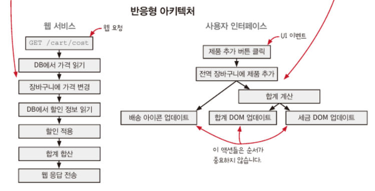
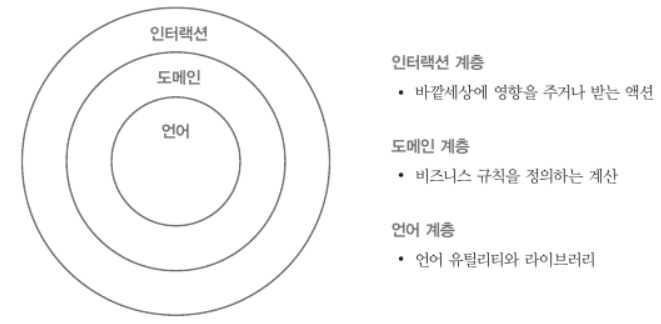
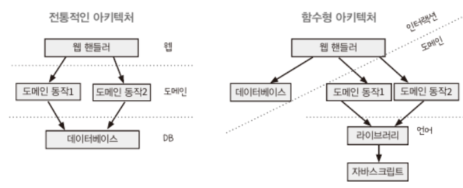
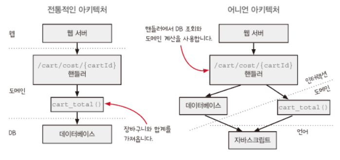

## 반응형 아키텍처와 어니언 아키텍처

> 문제 상황 : 장바구니에 관한 UI를 추가할 때마다 고쳐야 하는 곳이 10군데나 있다.

장바구니를 바꾸는 n가지 방법(제품 추가, 삭제, 쿠폰 추가, 수량 변경 등) _ 장바구니를 표시하는 m곳이 있기 때문에 전통적인 `n _ m` 문제를 겪고 있다.

### 반응형 아키텍처는 무엇인가요?

반응형 아키텍처 -> **애플리케이션을 구조화하는 방법**

- 핵심 원칙은 이벤트에 대한 반응으로 일어날 일을 지정하는 것이다.
- 웹 서비스와 UI에 잘 어울린다.
- 웹 요청 응답에 일어날 일을 지정하고, UI는 버튼 클릭과 같은 이벤트 응답에 일어날 일을 지정하면 된다. (이벤트 핸들러)

| 웹 서비스                | UI                           |
| ------------------------ | ---------------------------- |
| **GET /cart/cost**       | **제품 추가 버튼 클릭**      |
| 1. DB에서 가격 읽기      | 1. 전역 장바구니에 제품 추가 |
| 2. 장바구니에 가격 변경  | 2. 합계 계산                 |
| 3. DB에서 할인 정보 읽기 | 3. 합계 DOM 업데이트         |
| 4. 할인 적용             | 4. 배송 아이콘 업데이트      |
| 5. 합계 합산             | 5. 세금 DOM 업데이트         |
| 6. 웹 응답 전송          | -                            |

이를 반응형 아키텍처로 그리면 다음과 같다.



### 반응형 아키텍처의 절충점

> 여기서 질문이 있습니다...! ❓코드에 나타난 순차적 액션의 순서를 뒤집는다는 말이 무엇일까요...❓

- 원인과 효과가 결합한 것을 분리한다. -> 하려는 것을 정확하게 표현 가능
- 여러 단계를 파이프라인으로 처리한다. -> 액션과 계산을 조합할 수 있다.
- 타임라인이 유연해진다. -> 더 짧은 타임라인을 만들 수 있다.

### 셀은 일급 상태입니다

전역변수인 장바구니의 상태를 일급 함수로 만들어보자.

```ts
function ValueCell(initialValue) {
  const currentValue = initialValue;
  return {
    val: () => currentValue, // 현재 값을 가져온다.
    update: (f) => {
      // 현재 값에 함수를 적용해서 값을 바꾼다.(교체 패턴)
      const oldValue = currentValue;
      const newValue = f(oldValue);
      currentValue = newValue;
    },
  };
}
```

그러면서 원래 코드는 다음과 같이 바뀌면서, **shopping_cart를 읽고 쓰는 코드는 명확한 메서드 호출로 바뀐다.**

```ts
// 원래 코드
const shopping_cart = {};
function add_item_to_cart(name, price) {
  const item = make_cart_item(name, price);
  shopping_cart = add_item(shopping_cart, item);
  const total = calc_total(shopping_cart);
  set_cart_total_dom(total);
  update_shipping_icons(shopping_cart);
  update_tax_dom(total);
}

// 셀을 적용한 코드
const shopping_cart = ValueCell({});
function add_item_to_cart(name, price) {
  const item = make_cart_item(name, price);
  shopping_cart.update((cart) => add_item(cart, item));
  const total = calc_total(shopping_cart.val());
  set_cart_total_dom(total);
  update_shipping_icons(shopping_cart.val());
  update_tax_dom(total);
}
```

### ValueCell을 반응형으로 만들 수 있습니다

감시자(watcher) 개념을 추가해서 상태가 바뀔 때 어떤 동작을 하도록 만들 수 있다.

```ts
function ValueCell(initialValue) {
  const currentValue = initialValue;
  const watchers = []; // 감시자 목록 저장
  return {
    val: () => currentValue,
    update: (f) => {
      const oldValue = currentValue;
      const newValue = f(oldValue);
      if (oldValue !== newValue) {
        currentValue = newValue;
        forEach(watchers, (watcher) => watcher(newValue)); // 값이 바뀔 때 모든 감시자를 실행
      }
    },
    addWatcher: (f) => watchers.push(f), // 새로운 감시자를 추가
  };
}
```

> 감시자의 다른 이름으로는 이벤트 핸들러, 옵저버, 콜백, 리스너가 있다.

### 셀이 바뀔 때 배송 아이콘을 갱신할 수 있습니다

이제 장바구니가 바뀔 때 항상 배송 아이콘이 갱신되도록 할 수 있다.

```ts
const shopping_cart = ValueCell({});

function add_item_to_cart(name, price) {
  const item = make_cart_item(name, price);
  shopping_cart.update((cart) => add_item(cart, item));
  const total = calc_total(shopping_cart.val());
  set_cart_total_dom(total);
  update_tax_dom(total);
}

shopping_cart.addWatcher(update_shipping_icons);
```

얻은 효과는,

1. 핸들러 함수인 add_item_to_cart가 작아졌다.
2. 아이콘 갱신을 직접 하지 않고, 책임을 감시자에게 넘겼다.
3. 장바구니를 바꾸는 모든 핸들러에서 `update_shipping_icons()`를 부르지 않아도 된다.
4. 장바구니에 제품을 추가, 삭제, 수량 변경을 할 때마다 항상 배송 아이콘이 갱신된다.

### FormulaCell은 파생된 값을 계산합니다

어떤 셀은 다른 셀의 값을 최신으로 반영하기 위해 파생될 수 있다. 다른 셀의 변화가 감지되면 값을 다시 계산하는 것이다.

```ts
function FormulaCell(upstreamCell, f) {
  const myCell = ValueCell(f(upstreamCell.val()));
  upstreamCell.addWatcher((newUpstreamValue) => {
    // 셀 값을 다시 계산하기 위해서 감시자를 추가
    myCell.update((currentValue) => f(newUpstreamValue));
  });
  return {
    val: myCell.val, // val()을 myCell에 위임
    addWatcher: myCell.addWatcher, // addWatcher()를 myCell에 위임
  };
}
```

FormulaCell은 값을 직접 바꿀 수 없고, 감시하던 상위 셀 값이 바뀌면 FormulaCell 값이 바뀐다.

```ts
const shopping_cart = ValueCell({});
const cart_total = FormulaCell(shopping_cart, calc_total); // shopping_cart가 변할 때 cart_total도 함께 변한다.

function add_item_to_cart(name, price) {
  // 클릭 이벤트 핸들러는 더 간단해지고 더 명료해졌다.
  const item = make_cart_item(name, price);
  shopping_cart.update((cart) => add_item(cart, item));
}

shopping_cart.addWatcher(update_shipping_icons);
cart_total.addWatcher(set_cart_total_dom);
cart_total.addWatcher(update_tax_dom);
```

### 함수형 프로그래밍과 변경 가능한 상태

많은 소프트웨어가 변경 가능한 상태를 남용하는 상황을 없애기 위해, '함수형 개발자는 어떻게 해서든지 변경 가능한 상태를 사용하지 않는다.'라는 말이 있다.

**중요한 것은, 상태를 가능한 한 안전하게 사용하는 것이다!**

ValueCell의 `update()` 메서드를 사용하면 현재 값을 항상 올바르게 유지할 수 있는데, `update()`를 사용할 때 계산을 넘기기 때문이다.

> 많은 함수형 언어나 프레임워크에는 ValueCell과 같은 것이 있는데, 대표적으로 상태 관리 라이브러리인 Redux store와 Recoil atom이 있다.

### 반응형 아키텍처가 시스템을 어떻게 바꿨나요

#### 원인과 효과가 결합한 것을 분리합니다

일반적인 아키텍처에서는 장바구니를 바꾸는 모든 UI 이벤트 핸들러에 같은 코드를 넣어줘야 한다. `버튼 클릭`이라는 원인과 그로 인해 발생하는 `배송 아이콘 갱신`이라는 효과가 결합하여 있다.

🎈반응형 아키텍처를 사용하면 원인과 효과가 결합한 것을 분리할 수 있다. 어떤 원인에 의해 장바구니가 변경되더라도 배송 아이콘을 갱신한다.

원인과 효과가 늘어나면 관리해야 할 지점도 늘어나게 된다. 전역 장바구니는 원인과 결과의 중심이라고 할 수 있는데, 이를 잘 관리리해서 관리해야 할 것이 빠르게 늘어나지 않도록 해야 한다.

> [!WARNING]
> 단, 문제가 없는데 이 방법으로 분리하는 것은 좋지 않다. 코드에 액션을 순서대로 표현한는 것이 더 명확할 수도 있다.

#### 여러 단계를 파이프라인으로 처리합니다

어떤 일이 발생하는 여러 단계가 있다면 파이프라인으로 처리하는 것이 좋다. 각 단계에서 생성된 데이터는 다음 단계의 입력값으로 이용될 것이다.

자바스크립트를 사용한다면 Promise로 액션과 계산을 조합해 파이프라인을 구현할 수 있다. Promise는 단일값을 전달할 수 있기 때문에 파이프라인 단계 간 데이터를 전달할 수 있다.

> [!WARNING]
> 여러 단계가 있지만 데이터를 전달하지 않는다면 이 패턴을 사용하지 않는 것이 좋다. 데이터를 전달하지 않으면 파이프라인이라고 볼 수 없다.

#### 타임라인이 유연해집니다

반응형 아키텍처를 사용하면 순서를 정의하는 방법을 뒤집기(바꾸기가 적절한 단어 선택이지 않을까요...?) 때문에 자연스럽게 타임라인이 작은 부분으로 분리된다.

짧은 타임라인이 좋고, 적게 유지하는 것도 좋지만 공유하는 자원이 없으면 타임라인이 많아져도 문제가 없다.

---

### 어니언 아키텍처는 무엇인가요?

어니언 아키텍처 -> **현실 세계와 상호작용하기 위한 서비스 구조를 만드는 방법**



함수형 시스템이 잘 동작할 수 있는 중요한 규칙은 다음과 같다.

1. 현실 세계와 상호작용은 인터랙션 계층에서 해야 한다.
2. 계층에서 호출하는 방향은 중심 방향이다.
3. 계층은 외부에 어떤 계층이 있는지 모른다.

### 함수형 아키텍처

전통적인 아키텍처(웹 인터페이스 계층 - 도메인 계층 - 데이터베이스 계층)와 함수형 아키텍처를 비교해보자.



다른 점은,

- 함수형 아키텍처는 도메인 계층이 데이터베이스 계층에 의존하지 않는다.
- 데이터베이스 동작은 값을 바꾸거나 데이터베이스에 접근하기 때문에 액션이므로 액션과 계산을 구분하는 선을 그린다.
- 라이브러리나 언어 기능과 계산을 또 구분하는 선을 그린다.

> 함수형 개발자는 액션과 계산을 명확하게 구분하려고 하고 도메인 로직은 모두 계산으로 만들어야 한다고 생각한다. **따라서, 데이터베이스를 도메인과 분리하는 것이 중요하다.** 또한, 가장 위에 있는 액션에서 도메인 규칙과 데이터베이스를 조합한다.

### 변경과 재사용이 쉬워야 합니다

어떤 의미에서 소프트웨어 아키텍처는 변화를 다루는 일이다.

어니언 아키텍처에서 어떤 변화를 다루기 쉬운지 얘기해보자면, **인터랙션 계층(데이터베이스, 서비스 프로토콜)을 바꾸기 쉽다.** 가장 위에 있기도 하고, 도메인이 데이터베이스나 웹 요청에 의존하지 않기 때문이다.

쉽게 말하자면, 어니언 아키텍처는 데이터베이스나 API 호출과 같은 외부 서비스를 바꾸기 쉽다. 또한, 도메인 계층은 외부 서비스에 의존하지 않아서 테스트하기 좋다.

전형적인 아키텍처에서 도메인 규칙은 데이터베이스를 부르지만 어니언 아키텍처에서는 그렇게 하면 안된다. 장바구니 아이디가 123인 경우 /cart/cost/123 주소로 웹 요청을 하여 장바구니를 DB에서 가져오도록 하자.



- 전형적인 아키텍처의 경우
  - 순서대로 쌓여있다.
  - 웹 요청은 핸들러가 처리한다.
  - 핸들러는 데이터베이스에 접속하고 클라이언트에게 응답하기 위해 가장 높은 웹 계층으로 결과를 리턴한다.
  - 데이터베이스에서 합계를 가져와서 합산을 처리한다.
- 어니언 아키텍처의 경우
  - 웹 서버와 핸들러, 데이터베이스는 인터랙션 계층에 속한다.
  - `cart_total()`은 제품 가격을 가지고 장바구니 합계를 만드는 계산인데, 장바구니가 어디서 왔는지 모른다.
  - 핸들러가 데이터베이스에서 장바구니를 가져와 도메인에 전달하는 역할을 한다.
  - 인터랙션 계층에서 값을 가져오고 도메인 계층에서 합산한다.

**🎈액션에서 최대한 계산을 빼내는 것이 중요한 일이듯, 도메인을 계산으로 만드는 것은 항상 가능하면서 중요한 일이다!**

### 도메인 규칙은 도메인 용어를 사용합니다

프로그램의 핵심 로직을 보통 도메인 규칙이나 비즈니스 규칙이라고 한다.

도메인 용어를 사용하지 않으면 코드가 비즈니스에 중요한 부분이라고 해도 코드를 도메인 규칙이라 볼 수 없다.

```ts
let image = newImageDB.getImage("123"); // 데이터베이스는 도메인을 나타내는 용어가 아니다.
if (image === undefined) image = oldImageDB.getImage("123");

function getWithRetries(url, retriesLeft, success, error) {
  if (retriesLeft <= 0) error("No more retries");
  else
    ajaxGet(url, success, (e) =>
      getWithRetries(url, retriesLeft - 1, success, error)
    ); // AJAX 요청은 도메인 용어에 없다.
}
```

### 가독성을 따져 봐야 합니다

특정 패러다임의 장점이 항상 좋은 것이 아닌 듯이, 어떤 경우는 문맥에 따라 계산보다 액션이 읽기 좋은 경우가 있다.

어니언 아키텍처는 가장 이상적인 모습이지만, 세상에 완벽한 것은 없으므로 현실 세계의 문제와 이상적인 다이어그램 사이를 균형 있게 유지하는 것이 필요하다.

1. 코드의 가독성 - 함수형 코드가 아닌 코드가 더 명확한 경우가 있는데, 얼마나 더 명확해지는지 봐야 한다.
2. 개발 속도 - 비즈니스의 이유로 기능을 빨리 출시해야 하는 경우, 나중에 아키텍처에 맞춰 코드를 정리할 준비를 하는 것이 좋다.
3. 시스템 성능 - 변경 가능한 데이터 구조는 불변 데이터 구조보다 빠르다. 최적화는 인터랙션 계층에서 하고 도메인 계층은 재사용 가능한 계산으로 만드는 것이 가장 중요하다.
