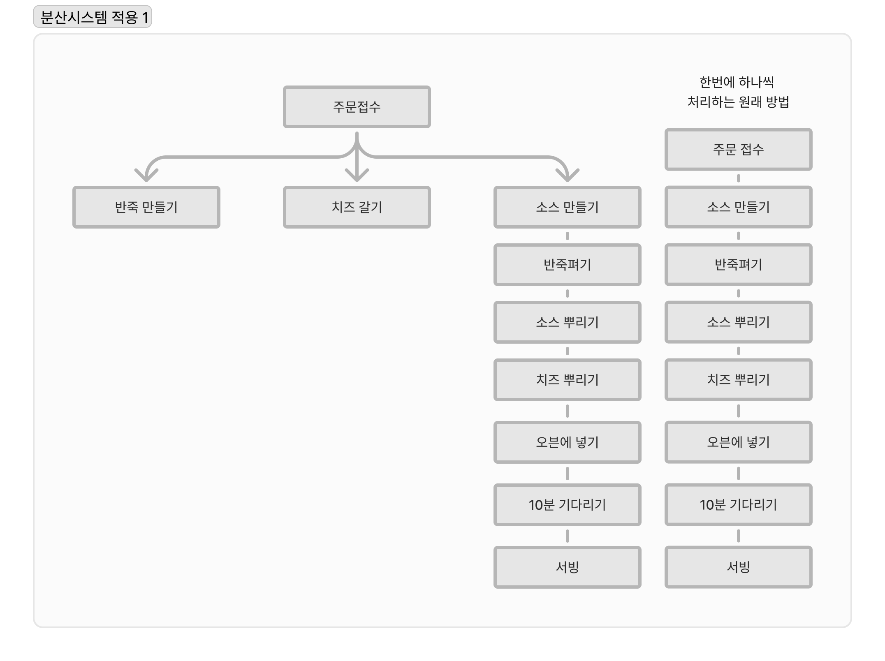
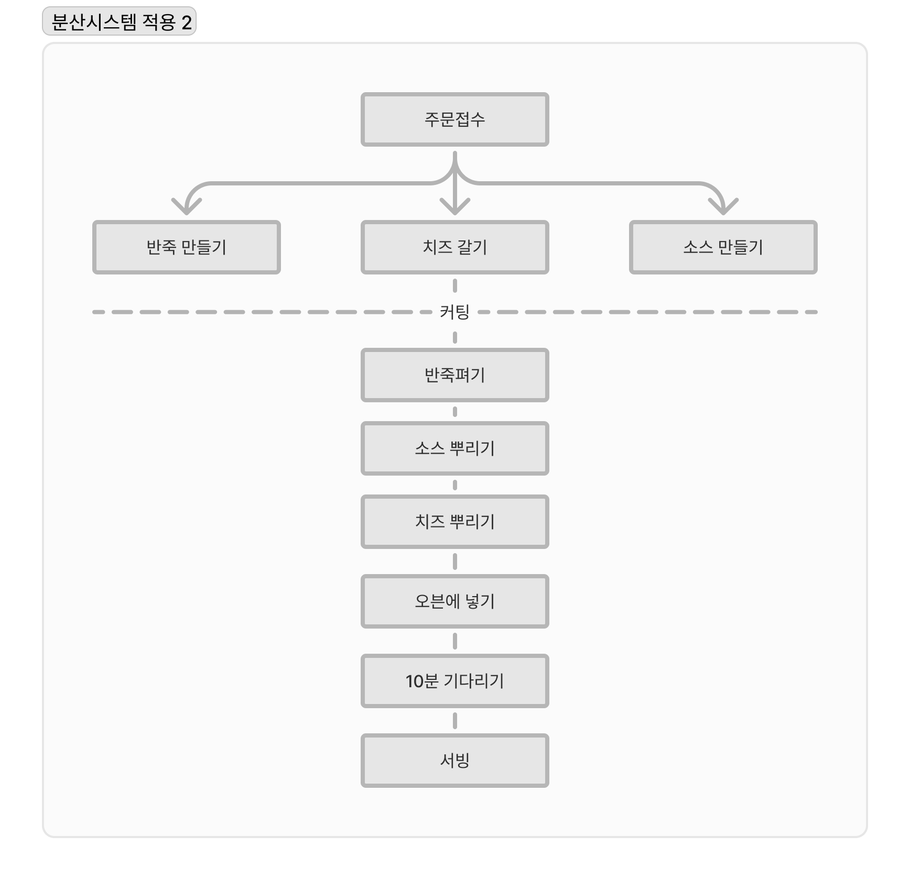

# 현실에서의 함수형 사고

이번 장에서 생각하며 볼 내용
- 현실적인 문제에 함수형 사고를 적용
- 소프트웨어 구조를 잡는데 계층형 설계가 좋은 이유
- 액션을 타임라인으로 시각화
- 타임라인을 사용하면 시간에 관한 문제를 잘 풀 수 있음

## 두가지 함수형 사고의 기술

1. 액션과 계산, 데이터
    **계층형 설계 원칙**을 적용

2. 일급 추상
    **타임라인 다이어그램**을 사용하면 실패하는 분산 시스템을 이해하기 좋음
    함수를 인자로 받는 **일급 함수**를 사용

### 액션과 계산 데이터

함수형 프로그래머는 코드에서 **가장 먼저 액션과 계산, 데이터를 구분하는것부터 시작**함
그 이유는 `쉽게 다룰수 있는 부분`과 `조심히 다뤄야 할 부분`을 **명확하게 하기 위함**

1. 액션
    - 호출하는 횟수와 시점에 의존
    - 액션은 사용할 때 조심
    - 예) 반죽 펴기, 피자 배달, 재료 주문

2. 계산
    - 어떤 것을 결정하거나 계획하는 것
    - 실행해도 다른 곳에 영향을 주지 않음
    - 예) 조리법에 나온 것을 두 배로 만들기, 쇼핑 목록 결정

3. 데이터
    - 가능한 변경 불가능한 데이터를 많이 사용해야 함
    - 유연하기 때문에 저장하거나, 네트워크로 전송하는 등 다양하게 사용가능
    - 예) 고객 주문, 영수증, 조리법

액션과 계산, 데이터로 계층화 설계를 해야 함

### 계층화 설계

코드를 변경할 때 드는 비용을 줄이기 위해 함수형 사고로 코드를 구성하면 좋음

먼저 변경 가능성에 따라 코드를 나눔
위쪽으로 갈수록 자주 바뀌는 코드가 있고, 아래쪽으로 갈수록 자주 바뀌지 않는 코드가 있는 그림을 그려보기

- 자주 바뀌는 것
  비즈니스 규칙
  예)이번 주 메뉴

- 중간(?)
  바뀔수도 있지만 자주 바뀌지 않는것
  도메인 규칙
  예)피자조리에 관한것

- 자주 바뀌지 않는 것
  가장 자주 바뀌지 않는것은 자바스크립트 언어 자체
  기술스택
  예) 배열이나 객체같은 언어 기능

각 계층은 그 아래에 있는 계층을 기반으로 만들어짐
그래서 잘 변경되지 않는 안정적인 기반위에 계층이 만들어짐
가장 **위에 있는 계층은 의존성이 거의 없기 때문에 쉽게 바꿀수 있고**,
**아래있는 계층들은 의존성은 있지만 쉽게 바뀌지 않음**

### 타임라인 다이어그램

타임라인에 있는 모든 단계는 액션
액션은 실행 시점에 의존하기 때문에 실행 순서가 중요

피자 만들기 액션을 타임라인으로 정리한 예
1. 주문접수
2. 반죽 만들기
3. 반죽 펴기
4. 소스 만들기
5. 소스 뿌리기
6. 치즈 갈기
7. 치즈 뿌리기
8. 오븐에 넣기
9. 10분 기다리기
10. 서빙

타임라인에 분산 시스템 적용하기

타임라인 다이어그램에 분산시스템을 적용하면, 실행 순서가 섞이는것도 생각해야 함
타임라인을 서로 맞추지 않은 분산시스템은 예측 불가능한 순서로 실행
기본적으로 타임라인은 서로 순서를 맞출수 있는 기능이 없음
액션이 실행되는 시간을 늦추더라도 작업의 시간이 얼마나 걸릴지 모르기 때문에 실행 순서가 완벽하다고 할 수 없음
반죽 만들기가 끝나기 전에 반죽펴기가 실행 될 수도 있음

그래서 반죽만들기, 치즈갈기, 소스 만들기처럼 먼저 선행되야 되는 액션들은 `타임라인 커팅`이라는 기술을 사용

타임라인 커팅은 고차 함수로 만든 동작인 고차 동작(high-order operation)으로 구현

**타임라인을 사용하면**
- 타임라인 커팅으로 서로 다른 작업들을 쉽게 이해가 가능
  동시에 할수 있는 재료 준비와 순서대로 해야하는 피자 만들기를 분리
- 시간에 따라 진행하는 작업을 쉽게 이해 할 수 있음
  타임라인은 동시에 실행되는 분산 시스템을 시각화 하기 좋음
- 타임라인 다이어그램은 유연
  타임라인을 보고 쉽게 코드로 옮길수 있고, 동시에 진행되는 작업을 쉽게 모델링 가능

---
# 이 장에서 중요하다고 생각되는 내용

1. 액션, 계산, 데이터로 분리할 때 계층화 설계를 하는게 중요하다
    - 안정된 기반위에 코드를 작성한다는 점이 중요한것 같음
    - 코드를 유지보수 하기 쉬운 구조를 만들수 있을것 같음
      의존성이 적은 코드를 작성

2. 분산시스템을 타임라인으로 시각화하기
    - 막상 코드를 짜다보면 이것저것 코드를 추가하게 되는데, 타임라인으로 시각화 하면 조금 더 차분히 구조를 고민할 수 있는것 같아 중요하다고 생각
    - 개념적인 걸 고민하면서 구조를 짤수 있게 해주는것 같음

