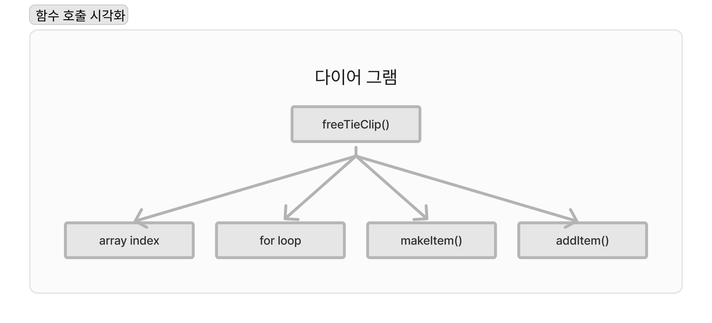
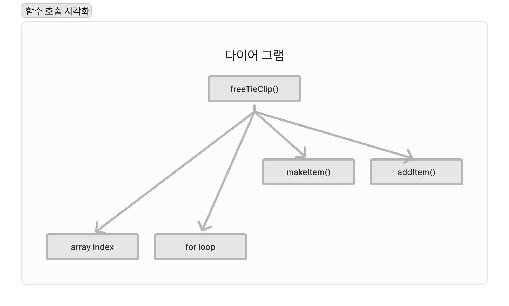
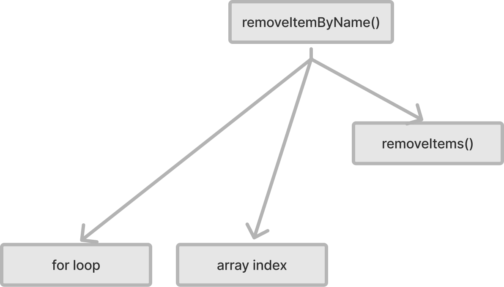
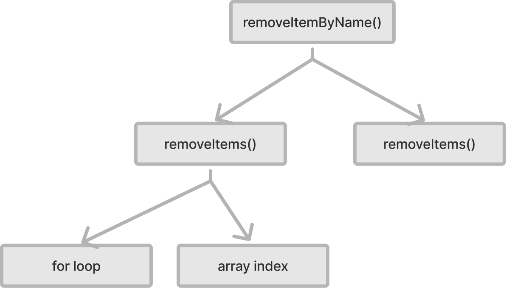

# 계층형 설계1

## 이번 장에서 살펴볼 내용

- 소프트 웨어 설계에 대한 실용적인 정의를 소개한다.
- 계층형 설게를 이해하고 어떤 도움이 되는지 알아본다.
- 깨끗한 코드를 만들기 위해 함수를 추출하는 방법을 배운다.
- 계층을 나눠서 소프트웨어를 설계하면 왜 더 나은 생각을 할 수 있는지 알아본다.

계층형 설계는 바로 아래 계층의 함수로 지금 계층의 함수를 만드는 방법이다.

## 소프트웨어 설계란?

코드를 만들고, 테스트하고, 유지보수 하기 쉬운 프로그래밍 방법을 선택하기 위해 미적 감각을 사용하는 것이 **소프트웨어 설계**다.   
코드에 대해 자신이 없다는 것은 설계가 잘못되었다는 신호이며, 설계가 잘 되어 있다면 아이디어를 코드로 구현하고 테스트하고 유지보수하기 쉬워진다.   

## 계층형 설계란?

소프트웨어를 계층으로 구성하는 기술로, 각 계층에 있는 함수는 바로 아래 계층에 있는 함수를 이용해 정의한다.   

**좋은 설계를 위한 감각은 어떻게 키울 수 있을까?**   
코드를 읽을 때 더 좋은 설계를 알려주는 신호를 찾는 법을 배워야 함   
설계를 개선하고, 개선한 것이 어떤 의미가 있는지 알아야 함

## 설계 감각을 키우는 방법

**계층형 설계 감각을 키우기 위한 입력**   
| 함수 본문 | 계층 구조 | 함수 시그니처 |
| --- | --- | --- |
| 길이 | 화살표 길이 | 함수명 |
| 복잡성 | 응집도 | 인자 이름 |
| 구체화 단계 | 구체화 단계 | 인잣값 |
| 함수 호출 |  | 리턴값 |
| 프로그래밍 언어의 기능 사용 |  |  |

다양한 입력을 이용해 계층형 설계에 대한 단서를 찾아야 됨

**계층형 설계 감각을 키우기 위한 출력**   
| 조직화 | 구현 | 변경 |
| --- | --- | --- |
| 새로운 함수를 어디에 놓을지 결정 | 구현 바꾸기 | 새 코드를 작성할 곳 선택하기 |
| 함수를 다른 곳으로 이동 | 함수 추출하기 | 적절한 수준의 구체화 단계 결정하기 |
|  | 데이터 구조 바꾸기 |  |

여러 입력을 보면 머리속에서 어떻게든 조합하게 된다.

## 계층형 설계 패턴

1. 직접 구현
2. 추상화 벽
3. 작은 인터페이스
4. 편리한 계층

이번 장에서는 직접 구현에 대해 배워볼 예정   
직접 구현된 함수를 읽을 때, 함수 시그니처가 나타내고 있는 문제를 함수 본문에서 적절한 구체화 수준에서 해결해야 함, 만약 너무 구체적이라면 코드에서 나는 냄새

## 직접 구현

계층 구조는 아무리 강력한 기능을 하는 함수가 있더라도 복잡하지 않게 함수를 표현 할 수 있어야 됨

### 넥타이 하나를 사면 무료로 넥타이 클립을 주는 코드 추가하기

```ts
const freeTieClip = (cart:Cart) => {
  let hasTie = false
  let hasTieClip = false;
  
  cart.forEach((item) => {
    if(item.name === "tie") {
      hasTie = true;
    }
    if(item.name === "tie clip") {
      hasTieClip = true;
    }
  });
  
  if(hasTie && !hasTieClip) {
    const tieClip = makeItem("tie clip", 0);
    return add_item(cart, tieClip);
  }

  return cart;
}
```
어렵지 않은 코드지만 많은 기능을 가지고 있으며, 설계를 하지 않고 간단하게 기능만 추가한 코드   
설계 원칙을 가지고 있지도 않음   
이렇게 코드를 바로 추가하면 유지보수 하기 점점 어려워짐   
freeTieClip 함수가 알아야 할 필요가 없는 구체적인 내용을 담고 있음   
장바구니가 배열이라는 사실을 몰라도 되는데 구체적인 내용을 담고 있어, 직접 구현을 따르지 않고 있음

### 코드 개선하기

첫번째로 코드에 있는 지식으로 장바구니가 해야 할 동작을 정리   
이 방법으로 습관적으로 코드를 바로 작성하는 대신 코드가 어떻게 동작하는지 파악이 가능

- ✅ 제품 추가하기
- ✅ 제품 삭제하기
- 장바구니에 제품이 있는지 확인하기
- ✅ 합계 계산하기
- 장바구니 비우기
- ✅ 제품 이름으로 가격 설정하기
- ✅ 세금 계산하기
- ✅ 무료 배송이 되는지 확인하기   

<br />

이제 개선 할 수 있는 부분을 발견할 수 있음   
제품이 있는지 확인하는 함수가 있다면 저수준의 반복문을 직접 쓰지 않아 freeTieClip 함수를 더 명확하게 하여 설계를 개선할 수 있음   
저수준의 코드는 추출해야 할 가능성이 높음   

```ts
// forEach 부분은 장바구니에 넥타이와 넥타이 클립이 있는지 확인하고 있음
const freeTieClip = (cart:Cart) => {
  let hasTie = false
  let hasTieClip = false;
  
  cart.forEach((item) => {
    if(item.name === "tie") {
      hasTie = true;
    }
    if(item.name === "tie clip") {
      hasTieClip = true;
    }
  });
  
  if(hasTie && !hasTieClip) {
    const tieClip = makeItem("tie clip", 0);
    return add_item(cart, tieClip);
  }

  return cart;
}

// 개선한 코드
const freeTieClip = (cart:Cart) => {
  let hasTie = isInCart(cart, "tie");
  let hasTieClip = isInCart(cart, "tie clip");
  
  if(hasTie && !hasTieClip) {
    const tieClip = makeItem("tie clip", 0);
    return add_item(cart, tieClip);
  }

  return cart;
}

const isInCart = (cart:Cart, name:string) => {
  cart.forEach((item) => {
    if(item.name === name) {
      return true;
    }
  });
  return false;
}
```
개선한 함수는 짧고 명확하며 모두 비슷한 구체화 수준에서 작동하고 있기 때문에 읽기 쉬움

### 함수 호출을 시각화 하기


함수에서 사용하는 다른 함수와 언어 기능을 호출 그래프로 그릴수 있음   

<br />

아래에 나열된 함수는 직전 만든 함수와 언어에서 제공하는 기능으로 같은 추상화 수준은 아님   
**서로 다른 추상화 수준을 다이어그램에 표시**



이렇게 하면 다른 추상화 단계에 있다는 것을 알아볼 수 있음   
함수가 다른 계층을 가리키고 있기 때문에 함수가 여러 계층을 사용한다고 할 수 있음   
**한 함수에서 서로 다른 추상화 단계를 사용하면 코드가 명확하지 않아 읽기 어려움**   

<br />

직접 구현 패턴을 사용하면 비슷한 추상화 계층에 있는 함수를 호출   

### 쉬는 시간

1. 호출 그래프가 필요할까?
    계층이 많으면 호출 그래프를 통해 시스템 계층이 어떻게 구성되어 있는지 전체적으로 보는것에 대한 도움이 될 것
2. 모든 다이어그램을 다 그려야 하는것인가?
    대부분 안그려도 되지만, 이런 다이어그램은 좋은 커뮤니티 도구가 됨

## 함수를 어느 계층에 불여야 할까?

함수를 어떤 계층에 놓을지 선택하는 과정은 복잡하기 때문에 아래를 참고해서 선택해야 함

1. 함수 이름은 함수가 어느 곳에 위치할지 결정하기 위한 정보로 사용 할 수 있음
2. 계층의 함수가 어떤 함수나 언어 기능을 호출하는지 확인
3. 같은 함수나 언어기능을 가리킨다는 것은 같은 계층에 있어도 좋다는 정보
4. 계층간 서로 구분되는 목적이 있다면 함수가 위치할 계층을 선택하는데 좋은 정보

## 그린 그래프가 맞는지 확인 하는 방법

1. 모든 함수가 그래프에 있어야 함
2. 함수 안에서 다른 함수를 호출한다면 반드시 표시되어야 함
3. 화살표는 옆이나 위가 아닌 아래로 향해야 함

## 3단계 줌레벨

계층형 설계에서 문제는 세가지 다른 영역에서 찾을 수 있음

1. 계층 사이에 상호 관계
2. 특정 계층의 구현
3. 특정 함수의 구현

### 전역 줌 레벨

전역 줌 레벨이 기본 줌 레벨이며 **계층 사이에 상호 관계를 포함해서 모든 문제 영역을 살펴 볼수 있음**

### 계층 줌 레벨

계층 줌 레벨은 한 계층과 연결된 바로 아래 계층을 볼 수 있는 줌 레벨로 **계층이 어떻게 구현되어 있는지 알 수 있음**

### 함수 줌 레벨

함수 줌 레벨로 함수 하나와 바로 아래 연결된 함수들을 볼 수 있음, 함수 줌 레벨로 **함수 구현의 문제를 찾을 수 있음**

## 화살표 비교

함수 줌 레벨을 사용하면 함수 하나가 가진 화살표를 비교 할 수 있음   
**화살표의 길이가 다르다는건 다른 두 계층에 있는 동작을 사용한 다는 것이며, 이것은 직접 구현 패턴에 맞지 않음**   

가장 일반적인 방법으로 중간에 함수를 두어 화살표의 길이를 맞출 수 있음

<div style="display:flex;">
  <span style="padding:20px;">
    개선 전
    
  </span>
  <span style="padding:20px;">
    개선 후
    
  </span>
</div>

```ts
// 개선 전 코드
const removeItemByName = (cart:Cart, name:string) => {
  let idx: null | number = null;
  cart.forEach((item, index) =>{
    if(item.name === name) {
      idx = index
    }
  })
  if(idx !== null) {
    return removeItem(cart, idx, 1);
  }
  return cart;
}

// 개선 후 코드
const removeItemByName = (cart:Cart, name:string) => {
  let idx = indexOfItem(cart, name);
  
  if(idx !== null) {
    return removeItem(cart, idx, 1);
  }
  return cart;
}

const indexOfItem = (cart:Cart, name:string) => {
  cart.forEach((item, index) =>{
    if(item.name === name) {
      return index;
    }
  })
  return null;
}
```

이렇게 하면 removeItems 함수와 indexOfItem함수는 같은 계층에 있는 것처럼 보인다.   
하지만 엄밀히 말하면 indexOfItem 함수가 removeItems 함수보다 조금 더 위에 위치한다.   
이유는, indexOfItem 함수는 배열에 있는 항목이 name속성을 가지고 있다는 것으로 알 수 있다.

## 요점 정리

- 계층형 설계는 코드를 추상화 계층으로 구성
- 문제 해결을 위한 함수를 구현할 때 어떤 구체화 단계로 쓸지 결정하는 것이 중요
- 함수의 이름과 본문, 호출 그래프를 이용해서 어떤 계층에 속할지 알아내야 함
- 함수 이름이 표현하는 의도를 보고 비슷한 목적을 가진 함수를 함께 묶어야 됨
- 함수를 호출하는 화살표가 다양한 길이를 가지고 있다면 직접 구현되어 있지 않다는 신호임
