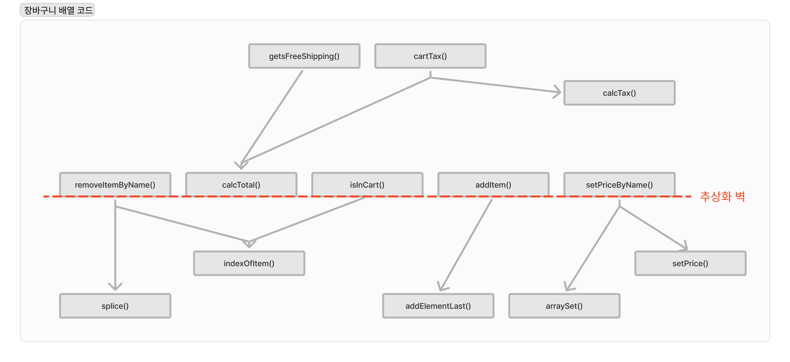
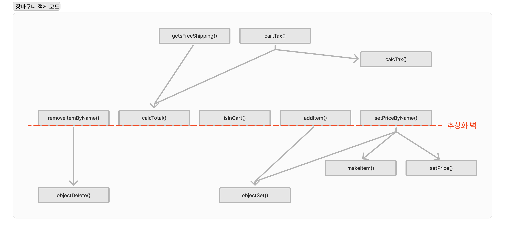

# 계층형 설계2

## 이번 장에서 살펴볼 내용

- 코드를 모듈화하기 위해 추상화 벽을 만드는 법을 배우기
- 좋은 인터페이스는 어떤것이고, 어떻게 찾는지 알아보기
- 설계가 이만하면 되었다고 할 수 있는 시점을 알기
- 왜 계층형 설계가 유지보수와 테스트, 재사용에 도움이 되는지 이해하기

## 계층형 설계 패턴

1. 직접 구현
2. 추상화 벽
3. 작은 인터페이스
4. 편리한 계층

## 추상화 벽

추상화 벽은 팀간의 책임을 명확하게 나눌 수 있도록 한다

### 추상화 벽으로 구현을 감춘다

추상화 벽은 세부 구현을 감춘 함수로 이루어진 계층으로 추상화 벽에 있는 함수를 사용할 때는 구현을 전혀 몰라도 함수를 사용할 수 있음   

<br />

추상화 벽은 데이터 구조를 몰라도 함수를 사용할 수 있음
추상화 벽 아래서 일하는 사람들은 추상화 벽에 있는 함수를 어떻게 쓰는지 신경 쓰지 않을 수 있음   

<br />

추상화 벽은 흔하게 사용하는 라이브러리나 API와 비슷함   

추상화 벽을 사용하면 추상화 벽 아래에서 사용하는 데이터 구조를 바꾸기 쉬움   
추상화 벽 아래에서 사용하는 배열을 객체로 바꿀때에도 추상화 벽 위에 있는 함수를 사용하는곳에 영향을 주지 않음

<br />

**장바구니를 객체로 다시 만들기**   




```ts
// 배열 코드
const addItem = (cart: Cart, item: Item) => {
  return addElementLast(cart, item);
}

const calcTotal = (cart: Cart) => {
  let total = 0;
  cart.forEach((item:Item) => {
    total += item.price;
  })
  return total;
}

const setPriceByName = (cart: Cart, name: string, price:number) => {
  const cartCopy = cart.slice();
  cartCopy.forEach((item:Item)=> {
    item = setPrice(item, price);
  })
  return cartCopy;
}

const removeItemByName = (cart: Cart, name: string) => {
  const idx = indexOfItem(cart, name);
  if(idx !== null){
    return splice(cart, idx, 1);
  }
  return cart;
}

const indexOfItem = (cart: Cart, name: string) => {
  cart.forEach((item: Item, index: number)=> {
    if(item.name === name) {
      return index;
    }
    return null;
  })
}

const inInCart = (cart: Cart, name: string) => {
  return indexOfItem(cart, name) !== null;
}
```

```ts
// 객체 코드
const addItem = (cart: Cart, item: Item) => {
  return objectSet(cart, item.name, item);
}

const calcTotal = (cart: Cart) => {
  let total = 0;
  const items = Object.values(cart);
  items.forEach((item:Item) => {
    total += item.price;
  })
  return total;
}

const setPriceByName = (cart: Cart, name: string, price:number) => {
  if(isInCart(cart, name)){
    const item = cart[name];
    const copy = setPrice(item, price);
    return objectSet(cart, name, copy);
  } else {
    const item  = makeItem(name, price);
    return objectSet(cart, name, item);
  }
}

const removeItemByName = (cart: Cart, name: string) => {
  return objectDelete(cart, name);
}

const inInCart = (cart: Cart, name: string) => {
  return cart.hasOwnProperty(name);
}
```



잘못 선탣한 데이터 구조가 때로는 어려운 코드를 만들지만, 추상화 벽으로 구현을 감추면 팀간의 커뮤니케이션 없이 데이터 구조를 변경할 수 있음   
데이터 구조를 변경하기 위해 함수 다섯 개만 바꿀수 있었던 것은 바꾼 함수가 추상화 벽에 있었기 때문   
추상화 벽은 **'어떤것을 신경 쓰지 않아도 되는가?'** 를 표현한 개념   

<br />

점선을 가로지르는 화살표가 없다는 것이 중요   
완전하지 않은 추상화 벽을 완전하게 만드는 방법은 추상화 벽에 새로운 함수를 만드는 것   

### 추상화 벽을 언제 사용해야 하는가?

1. 쉽게 구현을 바꾸기 위해

    - 프로토 타이핑과 같이 최선의 구현을 확신할 수 없는 작업에 유용

    - 서버에서 데이터를 받아서 처리해야 하지만 아직은 준비가 되지 않아 임시데이터를 줘야 하는 경우와 같이 뭔가 바뀔 것을 알고 있지만 아직 준비되는 않은 경우


2. 코드를 읽고 쓰기 쉽게 만들기 위해

    - 추상화 벽을 사용하면 세부적인 것을 신경 쓰지 않아도 됨

    - 적절한 것을 감추면 숙련된 프로그래머가 아니더라도 더 생산적인 코드를 만들 수 있음

3. 팀 간에 조율해야 할 것을 줄이기 위해

    - 추상화 벽을 사용하면 각 팀에 관한 구체적인 내용을 서로 신경 쓰지 않아도 일할 수 있음

4. 주어진 문제에 집중하기 위해

    - 추상화 벽을 사용하면 문제를 해결하기 더 쉬워짐

    - 추상화 벽을 사용하면 해결하려는 문제의 구체적인 부분을 무시할 수 있음

    - 코드에 실수를 줄이고, 만들면서 지치지 않을 수 있음


### 추상화 벽의 특징

- 추상화 벽 위에 있는 코드는 데이터 구조와 같은 구체적인 내용을 신경 쓰지 않아도 된다

- 추상화 벽과 그 아래에 있는 코드는 높은 수준의 계층에서 함수가 어떻게 사용되는지 몰라도 된다

- 추상화 단계의 상위에 있는 코드와 하위에 있는 코드는 서로 의존하지 않게 정의 한다.

- 바뀌지 않을지도 모르는 코드를 언젠가 쉽게 바꿀 수 있게 만들려는 함정에 빠지지 않아야 한다

- 추상화 벽은 팀 간에 커뮤니케이션 비용을 줄이고, 복잡한 코드를 명확하게 하기 위해 전략적으로 사용해야 한다

## 작은 인터페이스

작은 인터페이스는 새로운 코드를 추가할 위치에 관한 것으로, 인터페이스를 최소화하면 하위 계층에 불필요한 기능이 쓸데없이 커지는 것을 막을 수 있음

### 새로운 코드를 추가할 위치1

**예제로 마케팅팀에서 시계를 할인하려고 하는 상황으로 생각**   
장바구니에 제품을 많이 담은 사람이 시계를 구입하면 10% 할인해 주려고 함   

`if` 장바구니 총합 > $100 `and` 장바구니에 시계가 있으면 `then` 시계를 10% 할인

<br />

시계 할인 마케팅을 구현하기 위한 두가지 방법

1. 추상화 벽에 만들기
    추상화 벽 계층에 있으면 해시 맵 데이터 구조로 되어 있는 장바구니에 접근할 수 있지만, 같은 계층에 있는 함수를 사용할 수 없음

    ```ts
    const getsWatchDiscount = (cart: Cart) => {
      let total = 0;
      const items = Object.values(cart);
      items.forEach((item: Item) => {
        total += item.price;
      })
      return total > 100 && cart.hasOwnProperty('watch');
    }
    ```

2. 추상화 벽 위에 만들기
    추상화 벽 위에 만들면 해시 데이터 구조를 직접 접근할 수 없으며, 추상화 벽에 있는 함수를 사용해서 장바구니에 접근 해야 함

    ```ts
    const getsWatchDiscount = (cart:Cart) => {
      const total = calcTotal(cart);
      const hasWatch = isInCart("watch");
      return total > 100 && hasWatch;
    }
    ```

<br />

**추상화 벽 위에 있는 계층에 구현하는 것이 더 좋음**   
추상화 벽 위에 있는 계층에 만드는 것이 더 직접 구현에 가까움   
   
추상화 벽에 구현하는 방법을 사용하면 시스템 하위 계층 코드가 늘어나기 때문에 좋지 않음   
추상화 벽에 구현하는 방법은 반복문 같은 구체적인 구현에 신경을 써야 되기 때문에 개발팀에서 관리를 해야함, 그러면 마케팅팀에서 코드를 변경하고 싶을때 개발팀에 말해야 됨   
추상화 벽에 구현하는 방법은 만드는 함수가 개발팀과 마케팅팀의 계약과도 같아서 새로운 함수가 생긴다면 계약이 늘어나는거고, 사용하는 용어를 서로 맞춰야 함 그래서 추상화 벽의 장점을 약화시킴   

<br />

새로운 기능을 만들때 하위 계층에 기능을 추가하거나 고치는 것보다 **상위 계층에 만드는 것이 작은 인터페이스 패턴**이라고 할 수 있음

### 새로운 코드를 추가할 위치2

**예시로 마케팅팀이 장바구니에 제품을 담을 때 로그를 남기는 상황**   
```ts
// 로그를 남기는 코드
logAddToCart(userId, item)
```

<br />

addItem() 함수에 추가
    
```ts
// addItem 함수내에 추가
const addItem = (cart: Cart, item:Item) => {
  logAddToCart(globalUserId, item);
  return objectSet(cart, item.name, item);
}
```

- logAddToCart() 함수는 액션이기 때문에 기존에 계산으로 사용하던 addItem이 액션이 되며 액션이 전체 코드로 퍼져나감
    ```ts
    // 아이콘 업데이트를 하는데 (화면에 표시될때 호출됨) 로그를 찍음
    const updateShippingIcons = (cart: Cart) => {
      const buttons = getBuyButtonsDom();
      buttons.forEach((button) => {
        const item = button.item;
        const newCart = addItem(cart, item);
        if(getsFreeShipping(newCart)) {
          button.showFreeShippingIcon();
        } else {
          button.hideFreeShippingIcon();
        }
      })
    }
    ```
- 액션이 되며 테스트하기가 어려워짐

위치를 결정하는데 가장 중요한 요소는 장바구니에 관한 인터페이스를 깔끔하게 유지하는 점이기 때문에 logAddToCart() 함수는 추상화 벽 위에 있는 계층에서 호출하는 것이 좋음

<br />

addItemToCart() 함수에 추가

- 이미 액션인 함수
- 장바구니에 제품을 담을때 라는 요구사항과도 맞음

```ts
const addItemToCart = (name:string, price: number) => {
  const item = makeCartItem(name, price);
  shoppingCart = addItem(shoppingCart, item);
  const total = calcTotal(shoppingCart);
  setCartTotalDom(total);
  updateShippingIcons(shoppingCart);
  updateTaxDom(total);
  logAddToCart();
}
```

### 작은 인터페이스의 특징

- 추상화 벽을 작게 만들어야 하는 이유
    - 추상화 벽에 코드가 많을수록 구현이 변경되었을 때 고쳐야 할 것이 많음
    - 추상화 벽에 있는 코드는 낮은 수준의 코드이기 때문에 더 많은 버그가 있을 수 있음
    - 낮은 수준의 코드는 이해하기 더 어려움
    - 추상화 벽에 코드가 많을수록 팀 간 조율해야 할 것도 많아짐
    - 추상화 벽에 인터페이스가 많으면 알아야 할 것이 많아 사용하기 어려움

- 작은 인터페이스를 실천하는 방법은 상위 계층에 어떤 함수를 만들 때 가능한 현재 계층에 있는 함수로 구현하는 것

## 편리한 계층

- 작업하는 코드가 편리하다고 느낀다면 반복문은 감싸지 않고 그대로 두고 호출 화살표가 조금 길어지거나 계층이 다른 계층과 섞여도 설계를 조금 멈춰도 됨   
- 그렇게 설계를 멈추고 있다가 구체적인 것을 너무 많이 알아야 하거나, 코드가 지저분하다고 느낌다면 다시 패턴을 적용하면 됨   

```
💭 편리한 계층이 말하고 싶은건 너무 부담을 갖지 말라는 것 같다.
```

## 그래프로 알수 있는 것들

호출 그래프의 구조는 세가지 중요한 비기능적 요구사항을 나타냄

### 호출 그래프로 알수 있는 비기능적 요구사항 3가지

1. 유지보수성
2. 테스트성
3. 재사용성

### 유지보수성이 좋은 코드

호출 그래프의 가장 위에 있는 코드가 고치기 쉽고, 아래로 내려갈수록 고치기 어려움   
자주 바뀌는 코드는 위에 두고, 자주 바뀌지 않는 코드는 아래에 두는 것이 유지보수성을 생각해 계층화 하는 것

### 테스트성이 좋은 코드

호출 그래프의 위에 있는 코드를 테스트 하면 많은 코드를 확인할 수 있음   
호출 그래프의 아래에 있는 코드를 테스트 하면 그 함수를 호출하는 곳에서 믿고 사용 가능

<br />

모든 함수를 테스트 하거나 테스트는 많을 수록 좋지만, 테스트 할 수 있는 자원이 한정적이라면 아래에 있는 함수를 테스트 하는것이 좋음   
하위 계층 코드를 테스트 할 수록 얻은 것이 더 오래가기 때문(자주 안바뀜)

### 재사용성이 좋은 코드

아래쪽으로 가리키는 화살표가 적은 함수가 재사용성이 좋은 함수   
그래서 낮은 계층으로 함수를 추출하면 재사용할 가능성이 많아짐

## 요약 정리
- 추상화 벽 패턴을 사용하면 세부적인 것을 완벽히 감출 수 있기 때문에 더 높은 차원에서 생각할 수 있음
- 작은 인터페이스 패턴을 사용하면 완성된 인터페이스에 가깝게 계층을 만들 수 있음
- 편리한 계층 패턴을 이용하면 다른 패턴을 요구 사항에 맞에 사용할 수 있음
- 호출 그래프 구조에서 규칙을 얻을수 있음
