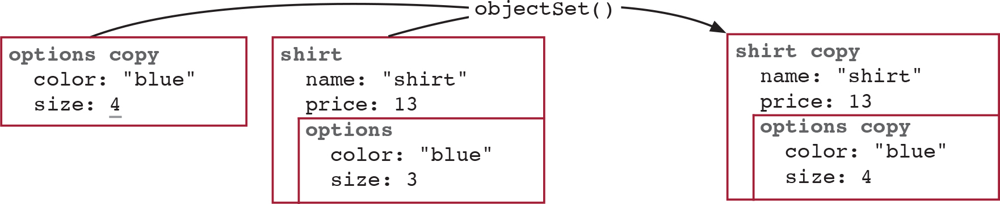

# 중첩된 데이터에 함수형 도구 사용하기

## 객체를 다루기 위한 고차 함수

객체의 특정 키값을 변경하는 함수
```ts
const incrementQuantity = (item: Item) => {
  const quantity = item['quantity'];
  const newQuantity = quantity + 1;
  const newItem = objectSet(item, 'quantity', newQuantity);
  return newItem;
}

const incrementSize = (item: Item) => {
  const size = item['size'];
  const newSize = size + 1;
  const newItem = objectSet(item, 'size', newSize);
  return newItem;
}
```
필드명(암묵적 인자)이 함수명에 있음   
   
암묵적 인자 드러내기로 변경한 코드
```ts
const incrementField = (item: Item, field: keyof Item) => {
  const value = item[field];
  const newValue = value + 1;
  const newItem = objectSet(item, field, newValue);
  return newItem;
}

const decrementField = (item: Item, field: keyof Item) => {
  const value = item[field];
  const newValue = value - 1;
  const newItem = objectSet(item, field, newValue);
  return newItem;
}

const doubleField = (item: Item, field: keyof Item) => {
  const value = item[field];
  const newValue = value * 2;
  const newItem = objectSet(item, field, newValue);
  return newItem;
}

const halveField = (item: Item, field: keyof Item) => {
  const value = item[field];
  const newValue = value / 2;
  const newItem = objectSet(item, field, newValue);
  return newItem;
}
```
하지만 아직 동작(암묵적 인자)이 함수명에 있음   
   
**암묵적 인자 드러내기**를 하는데 명시적으로 바꿔야 할 인자가 일반값이 아니고 동작이라   
**함수 본문을 콜백으로 바꾸기** 리팩터링을 해야 함   

> [!NOTE]   
> 명시적으로 바꿔야 할 인자가 일반값이냐 동작이냐에 따라서 인자로 값을 받을지 함수로 바꿀지 결정 됨
   
위의 함수들 내부에 있는 내용을 `update()` 함수로 추출
```ts
type Modify<T> = (value: T) => T;
const update = <T, K extends keyof T>(object: T, key: K, modify: Modify<T[K]>): T => {
  const value = object[key];
  const newValue = modify(value);
  const newObject = objectSet(object, key, newValue);
  return newObject;
}

const incrementField = (item: Item, field: keyof Item) => {
  return update(item, field, (value) => value + 1)
}
{...}
```

## 중첩된 update() 함수

중첩된 데이터 바꾸기

```ts
const incrementSize = (item: Item) => {
  const options = item.options;
  const size = options.size;
  const newSize = size + 1;
  const newOptions = objectSet(options, 'size', newSize);
  const newItem = objectSet(item, 'options', newOptions);
  return newItem;
}

// 한번 리팩토링한 코드
const incrementSize = (item: Item) => {
  const options = item.options;
  const newOptions = update(options, 'size', increment);
  const newItem = objectSet(item, 'options', newOptions);
  return newItem;
}

// 두번 리팩토링한 코드
const incrementSize = (item: Item) => {
  return update(item, 'options', (options) => {
    return update(options, 'size', increment);
  });
}
```
중첩된 데이터도 update함수를 사용해서 처리가 가능   

다수 중첩된 데이터 처리
```ts
// 두번 중첩
const update2 = <T, K1 extends keyof T, K2 extends keyof T[K1]>(
  object: T,
  key1: K1,
  key2: K2,
  modify: T[K1][K2]
): T => {
  return update(object, key1, function (value1) {
    return update(value1, key2, () => modify);
  });
};

// 세번 중첩
const update3 = (object, key1, key2, key3, modify) => {
  return update(object, key1, function(object2) {
    return update2(object2, key2, key3, modify);
  });
}

// 다수 중첩
const nestedUpdate = <T, K extends keyof any>(
  object: T,
  keys: K[],
  modify: (value: any) => any
): T => {
  if (keys.length === 0) {
    return modify(object);
  }

  const [key1, ...restOfKeys] = keys;
  return update(object, key1 as keyof T, (value1) => {
    return nestedUpdate(value1, restOfKeys, modify);
  });
};
```
여러개의 중첩을 해결하기 위해 재귀함수를 사용해서 update
> ❓     
> chatGPT 이용해서 타입 지정 해본건데,   
> 다른분들은 어느정도까지 지정하시나요?   
> 저같은 경우는 keys에 string[]으로 지정하고 지정하기 힘든것들은 any로 지정하기도 하거든요...;;

> 💡   
> objectSet과 같은 함수는   
> {...object, key: value}   
> 로 구현 할 수 있어서 구지 필요 없다고 생각했는데,   
> 작은 함수가 update()가 되고   
> 그 함수가 nestedUpdate가 되는걸 보니   
> 작은 함수들도 언제 쓸지 모르기 때문에 함수로 구현해두어야 되는건가 싶습니다.   

## 안전한 재귀 사용법

1. 종료조건
    보통 배열 인자가 비었거나, 점점 줄어드는 값이 0이 되었거나, 찾아야 할 것이 없을 때 종료 조건이 된다.   
    ex) `if(keys.length === 0)`

2. 재귀호출
    최소 하나의 재귀 호출이 있어야 함(자기 자신을 호출)

3. 종료 조건에 다가가기
    최소 하나 이상의 인자가 점점 줄어들어야 함   
    같은 인자를 그대로 전달하면 무한 반복에 빠짐   
    ex) `const restOfKeys = drop_first(keys);`

> [!NOTE]   
> 재귀함수를 만들때는 종료조건, 재귀 호출, 종료 조건에 다가가기를 생각해서 만들면 됨

### 재귀 함수가 적합한 이유
중첩된 데이터를 다루는 방법은 점점 아래 단계로 내려가면서 최종값에 도착하면 값을 변경하고, 나오면서 새로운 값을 설정   
이런 경우에는 재귀 함수가 종료 조건까지 호출되면서 종료조건에서 값을 변경하고, 함수가 리턴되면서 새로운값을 설정 하기 때문에 적합

## 깊이 중첩된 데이터에 추상화벽 사용하기

```ts
nestedUpdate(blogCategory, ["posts", "12", "author", "name"], capitalize)
```
1. `posts` 키 아래 블로그 글을 담고 있고
2. 각 블로그 글은 `id`를 통해 접근가능하고
3. 블로그 글은 `author` 키 아래 글쓴이 정보를 담고 있고,
4. 글쓴이는 `name` 안에 이름을 가지고 있다

이런 정보들을 알고 있어야 되기 때문에   
각 데이터 구조에 어떤 키가 있는지 기억하지 않도록 직접구현으로 해결해야 함   
기억해야 할 것이 너무 많을 때 추상화 벽을 사용하면 구체적인것을 몰라도 됨

```ts
const updatePostById = (category: Category, id: string, modifyPost: (value: Post) => Category) => {
  return nestedUpdate(category, ['posts', id], modifyPost);
}

const updateAuthor = (post: Post, modifyUser: (value: User) => Post) => {
  return update(post, 'author', modifyUser);
}

const capitalizeName = (user: User) => {
  return update(user, 'name', capitalize);
}

updatePostById(blogCategory, '12', (post: Post) => {
  return updateAuthor(post, capitalizeUserName);
});
```
이렇게 하면 함수를 사용하는 곳에서 어떤 키에 값이 들어 있는지 몰라도 됨   

# 앞에서 배운 고차 함수들
1. 배열을 반복할때 for 반복문 대신 사용
    - forEach()
    - map()
    - filter()
    - reduce()

2. 중첩된 데이터를 효울적으로 다루기
    - nestedUpdate()

3. 카피-온-라이드 원칙 적용하기
    - withArrayCopy()
    - withObjectCopy()

4. try/catch 로깅 규칙을 코드화
    - wrapLogging()

> 💡   
> 평소에 재귀함수를 잘 사용하지 않는데, 알고리즘 공부할 때 말고 쓸 상황이 없었던것 같습니다.   
> 이렇게 중첩된 데이터에 사용하기 좋은게 재귀함수라는것도 알았고, 재귀함수에서 중요한걸 명시적으로 적어봤던 점이 좋았던것 같습니다!   