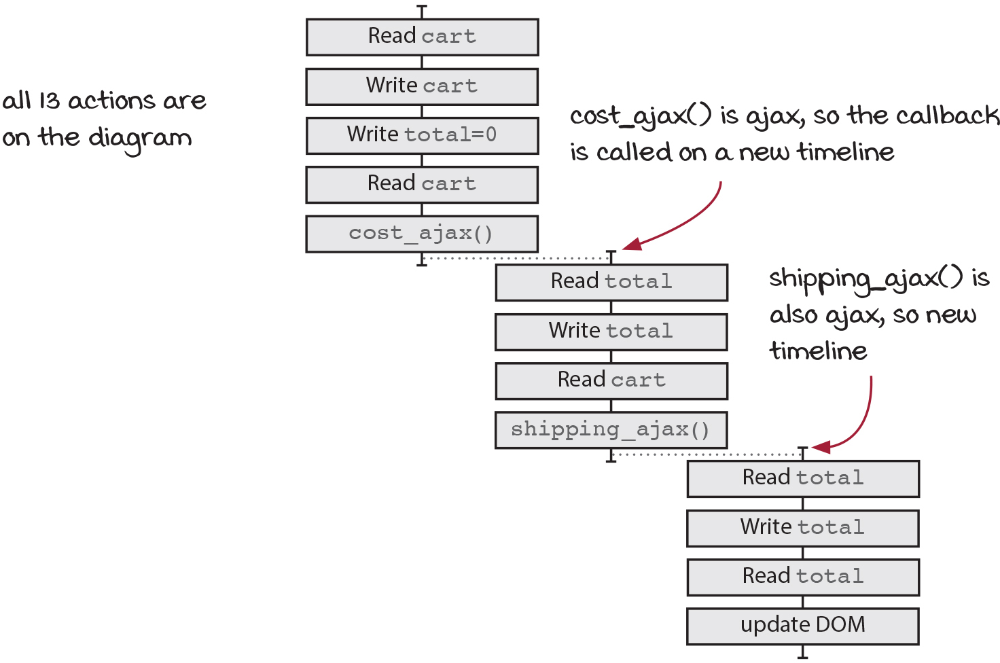

# 타임라인 격리하기

타임라인 다이어그램은 시간에 따른 액션 순서를 시각적으로 표시한 것

## 타임라인 다이어그램의 기본 규칙

코드를 타임라인 다이어그램으로 바꿀 때 중요

1. 두 액션이 순서대로 나타나면 같은 타임라인에 넣는다.

```ts
sendEmail1(); // 액션
sendEmail2(); // 액션
```


2. 두 액션이 동시에 실행되거나 순서를 예상할 수 없다면 분리된 타임라인에 넣는다.

```ts
setTimeout(sendEmail1, Math.random() * 10000); // 비동기 콜백
setTimeout(sendEmail2, Math.random() * 10000); // 비동기 콜백
```


> [!NOTE]   
> 서로 다른 타임라인에 표시해야 되는 경우   
> 1. 다른 스레드   
> 2. 다른 프로세스   
> 3. 다른 기계   
> 4. 비동기 콜백   

## 액션 순서를 생각할 때 주의할 점

1. `++`와 `+=`는 사실 3개의 단계

```ts
total++ // 이 코드는 아래의 코드와 같음

let temp =  total; // 읽기(액션)
temp =  temp + 1; // 더하기(계산)
total = temp; // 쓰기(액션)
```
그래서 타임라인에는 `total 읽기`와 `total 쓰기`가 그려져야 됨

2. 인자는 함수를 부르기 전에 실행

```ts
console.log(total); // 이 코드는 아래와 같음

const temp = total; // total 읽기
console.log(temp); // console.log() 호출
```

그래서 타임라인에는 `total 읽기`와 `console.log()`가 그려져야 됨


## 타임라인 그리기

### 1단계 액션을 확인하기

```ts
const add_item_to_cart = (name: string, price: number, quantity:number) => {
  cart = add_item(cart, name, price, quantity);
  calc_cart_total();
}

const calc_cart_total = () => {
  total = 0;
  cost_ajax(cart, (cost) => {
    total += cost; // 주의 읽기와 쓰기를 둘다 가지고 있음
    shipping_ajax(cart, (shipping) => {
      total += shipping; // 주의 읽기와 쓰기를 둘다 가지고 있음
      update_total_dom(total);
    });
  });
}
```

액션
- cart 읽기
- cart 쓰기
- total = 0 쓰기
- cart 읽기
- cost_ajax 부르기
- total 읽기
- total 쓰기
- cart 읽기
- shipping_ajax 부르기
- total 읽기
- total 쓰기
- total 읽기
- update_total_dom 부르기


### 2단계 각 액션을 그리기



`cost_ajax()`에 전달한 비동기 콜백과 `shipping_ajax()`에 전달한 비동기 콜백은 다른 타임라인에 그려준다.   


### 3단계 타임라인 단순화하기


- 자바스크립트는 하나의 스레드이기 때문에 순서대로 정리된 액션은 하나로 통합가능
- 타임라인이 끝나는 곳에서 새로운 타임라인이 하나만 생긴다면 통합 가능
- 비동기 타임라인은 통합하지 않아야 됨

> [!TIP]   
> 자바스크립트 동작원리 간단하게 정리   
> 1. 자바스크립트는 함수를 콜스택에서 실행   
> 2. 이벤트 루프는 콜스택이 비어있는지 계속 확인하고 큐에서 함수를 콜스택으로 옮김   
> 3. 비동기 작업은 태스크 큐에 쌓인다   
> (비동기 작업 중 promise같은 비동기는 마이크로 태스크 큐로 가고, setTimeout같은 비동기는 일단 테스크 큐로 간다. 이때, 마이크로 태스크큐가 더 높은 우선순위를 가져 더 먼저 콜스택으로 보내진다)

## 타임라인 주의사항

### 타임라인의 순서대로 실행되는 코드에도 두가지 종류가 있음   
- 순서가 섞일 수 있는 코드: 액션이 나뉘어져 있는 함수는 다른 타임라인의 함수와 호출 순서가 섞일 수 있음
- 순서가 섞일 수 없는 코드: 액션을 단순화하여 하나로 묶은 액션은 순서가 섞일수 없음(자바스크립트의 단일 스래드 원리 덕분에)

### 타임라인 다이어그램으로 동시에 실행되는 코드는 순서를 예측할 수 없음

- 다른 타임라인이라면 동시에 실행해도 어느쪽이 먼저 끝날지 모르기 때문에 순서를 예측 할 수 없음

## 좋은 타임라인의 원칙

1. 타임라인은 적을 수록 이해하기 쉬움
2. 타임라인은 짧을수록 이해하기 쉬움
3. 공유하는 자원이 적을수록 이해하기 쉬움
4. 자원을 공유한다면 서로 조율해야 함
    타임라인간 조율은 올바른 결과를 주지 않는 실행 순서를 없애는 것을 의미함
5. 시간을 일급으로 다룸

### 자원을 공유하는 타임라인 개선하기

1. 전역 변수를 지역변수로 바꾸기

    ```ts
    const calc_cart_total = () => {
      let total = 0; // 전역변수를 지역변수로 변경
      cost_ajax(cart, (cost) => {
        total += cost;
        shipping_ajax(cart, (shipping) => {
          total += shipping;
          update_total_dom(total);
        });
      });
    }
    ```
    전역 변수를 지역변수로 바꿈으로 인해서 액션이 줄어듬 
    - cart 읽기
    - cart 쓰기
    - cart 읽기
    - cost_ajax 부르기 `첫번째 단계`
    - cart 읽기
    - shipping_ajax 부르기 `두번째 단계`
    - update_total_dom 부르기 `세번째 단계`
   
2. 전역 변수를 인자로 바꾸기

```ts
const add_item_to_cart = (name: string, price: number, quantity:number) => {
  cart = add_item(cart, name, price, quantity);
  calc_cart_total(cart);
}

const calc_cart_total = (cart) => {
  let total = 0;
  cost_ajax(cart, (cost) => {
    total += cost;
    shipping_ajax(cart, (shipping) => {
      total += shipping;
      update_total_dom(total);
    });
  });
}
```
전역 변수를 인자로 전달해서 액션을 줄임   

- cart 읽기
- cart 쓰기
- cart 읽기
- cost_ajax 부르기 `첫번째 단계`
- shipping_ajax 부르기 `두번째 단계`
- update_total_dom 부르기 `세번째 단계`

두번째 단계의 cart 참조를 없애 첫번째에서만 전역 정보를 읽음   
첫번째 단계는 하나의 액션으로 통합되었기 때문에 cart정보 때문에 실행순서가 꼬이는 상황은 없음   


하지만 아직 dom을 업데이트하는 자원을 여전히 공유하고 있음(다음장에서 배울 예정)   
   
**코드 개선**
```ts
const add_item_to_cart = (name: string, price: number, quantity:number) => {
  cart = add_item(cart, name, price, quantity);
  calc_cart_total(cart, update_total_dom);
}

const calc_cart_total = (cart, callback) => {
  let total = 0;
  cost_ajax(cart, (cost) => {
    total += cost;
    shipping_ajax(cart, (shipping) => {
      total += shipping;
      callback(total);
    });
  });
}
```
비동기호출에서는 명시적인 출력 대신 콜백을 사용


