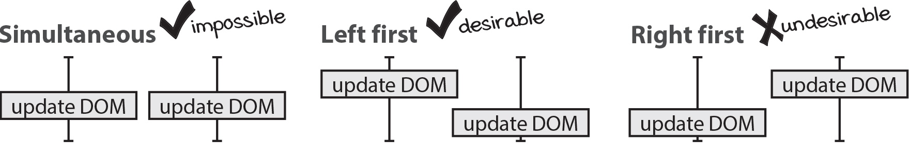
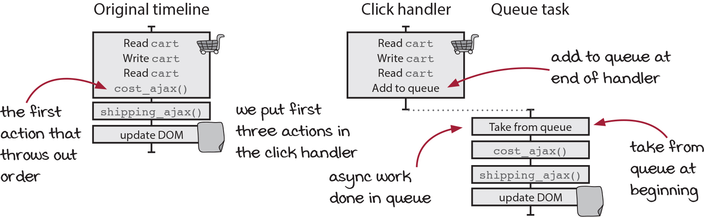

# 타임라인 사이에 자원 공유하기

## 좋은 타임라인 원칙 5가지

1. 타임라인은 적을수록 이해하기 쉽습니다.
2. 타임라인은 짧을수록 이해하기 쉽습니다.
3. 공유하는 자원이 적을수록 이해하기 쉽습니다.
4. 자원을 공유한다면 서로 조율해야 합니다.
5. 시간을 일급으로 다룹니다.

## 자원을 공유한다면 서로 조율해야 합니다.
- 타임라인을 조율한다는 것은 실행 가능한 순서를 줄인다는 것   
- 올바른 결과가 나오지 않는 순서를 없애면 분석하기 쉬워짐

예상 해볼 수 있는 **실행 가능한 순서**는



동시에는 단일스레드에서는 불가능   
왼쪽 먼저 실행되는 순서는 우리가 원하는 것   
오른쪽 먼저 실행되는 순서는 버그 발생의 원인   
   
올바른 결과가 나오지 않는 **오른쪽 먼저 실행되는 순서를 없앤다**.

## 순서를 보장하는 방법

현실에서는 어떤 일이 순서대로 진행되게 하는 방법으로 **줄을 서는 것**이 있음   
**큐(queue)** 는 넣은 순서대로 항목을 꺼낼수 있는 데이터 구조(FIFO)   
큐는 여러 타임 라인에 있는 액션 순서를 조율하기 위해 많이 사용   

### 자바스크립트에서 큐(queue)만들기

큐는 자료구조지만 타임라인 조율에 사용한다면 **동시성 기본형**이라고 부름   
`동시성 기본형`은 자원을 안전하게 공유할 수 있는 재사용 가능한 코드를 말함   

1. 큐에서 할 일과 핸들러에서 할 일을 나눔
    클릭 핸들러에는 다른 작업이 끼어들 수 없어서 **가능한 많은 작업을 클릭 핸들러에서** 하는것이 좋음   
    다음에 순서가 끼어들 수 있는 **첫번째 액션 전에** 큐로 보내면 좋음   
       
    

처음 코드
```ts
function add_item_to_cart(item) {
  cart = add_item(cart, item);
  calc_cart_total(cart, update_total_dom);
}

function calc_cart_total(cart, callback) {
  let total = 0;
  cost_ajax(cart, function(cost) {
    total += cost;
    shipping_ajax(cart, function(shipping) {
      total += shipping;
      callback(total);
    });
  });
}
```
   
클릭 핸들러의 제일 마지막에 큐에 항목을 추가하는 함수를 호출
```ts
function add_item_to_cart(item) { // 핸들러
  cart = add_item(cart, item);
  update_total_queue(cart); // 1. 큐에 추가
}

{...}
```
   
runNext함수로 큐에 있는 첫번째 함수를 실행해줌
```ts
{...}

const queue_items = []; // 1. 큐 데이터를 담을 배열

function runNext() {
  const cart = queue_items.shift(); // 4. 큐의 값을 빼낸다 (FIFO기 때문에 첫번째 값을 빼감)
  calc_cart_total(cart, update_total_dom); // 5. 순서가 바뀔수 있는 액션 호출
}

function update_total_queue(cart) {
  queue_items.push(cart); // 2. 큐에 담길 데이터를 배열 끝에 추가
  setTimeout(runNext, 0); // 3. 비동기로 호출해서 이벤트루프에 작업을 추가
}
```
아직 runNext 호출을 막는 코드가 없어서 동시에 두개가 동작할 수 있기 때문에
변수를 추가해서 현재 동작하는 작업이 있다면 동시에 동작하는것을 막아줌
```ts
{...}

const queue_items = [];
let working = false; // 동시 동작을 판단하기 위한 플래그

function runNext() {
  if(working) return; // 1. 현재 동작하는 작업이 있는지 확인해서 동작을 막아줌
  working = true; // 2. 함수가 호출되면 그 다음 호출을 막기 위해 true로 변경
  const cart = queue_items.shift();
  calc_cart_total(cart, update_total_dom);
}

{...}
```
working을 초기화 해주는 코드가 없어 아직 항상 하나만 실행이 됨   
   
비동기 실행이 끝나면 다시 다음꺼를 실행할수 있도록 만들어줌
```ts
{...}

function runNext() {
  if(working) return;
  working = true;
  const cart = queue_items.shift();
  calc_cart_total(cart, function(total) {
    update_total_dom(total);
    working = false; // false로 바꾸는 코드를 추가해서 다음 작업에 return 되지 않도록 함
    runNext(); // 재귀로 계속 실행 될수 있도록 호출 
  });
}

{...}
```

큐에 작업이 없었을때 재귀를 종료할 수 있는 코드 추가
```ts
{...}

function runNext() {
  if(working) return;
  if(queue_items.length === 0) return; // 큐에 작업이 없을때 재귀함수를 정지하는 코드
  working = true;
  const cart = queue_items.shift();
  calc_cart_total(cart, function(total) {
    update_total_dom(total);
    working = false;
    runNext();
  });
}

{...}
```

전역 변수와 함수를 함수 범위로 넣어서 다른곳에서 접근하지 못하게 해야 됨   
Queue() 함수로 묶어서 update_total_queue함수를 리턴   
리턴된 함수를 원래 함수처럼 사용가능
```ts
function Queue() { // Queue()함수로 묶어 주기
  const queue_items = [];
  let working = false;

  function runNext() {
    if(working) return;
    if(queue_items.length === 0) return;
    working = true;
    const cart = queue_items.shift();
    calc_cart_total(cart, function(total) {
      update_total_dom(total);
      working = false;
      runNext();
    });
  }

  return function(cart) { // update_total_queue() 함수를 익명함수로 바꾸고 리턴
    queue_items.push(cart);
    setTimeout(runNext, 0);
  };
}

const update_total_queue = Queue(); // 리턴시킨 익명함수를 기존에 쓰던 함수이름과 일치시키기
```

### Queue()를 재사용 할 수 있도록 만들기
지금은 특정 동작이 Queue 안에 들어가서 특정 상황에서만 사용 가능

```ts
function Queue(worker) { // 2. 큐로 관리하고 싶은 함수 인자로 받음
  const queue_items = [];
  let working = false;

  function runNext() {
    if(working) return;
    if(queue_items.length === 0) return;
    working = true;
    const item = queue_items.shift();
    worker(item.data, function(val) { // 3. 큐로 전달된 함수 호출
      working = false;
      setTimeout(item.callback, 0, val);
      runNext();
    });
  }

  return function(data, callback) { // 큐 생성할 때 전단할 함수 호출 할 수 있는 함수 리턴
    queue_items.push({
      data: data,
      callback: callback || function(){}
    });
    setTimeout(runNext, 0);
  };
}


function calc_cart_worker(cart, done) {
  calc_cart_total(cart, function(total) {
    update_total_dom(total);
    done(total);
  });
}

const update_total_queue = Queue(calc_cart_worker); // 1. 정의한 함수 전달
```
특정 동작을 Queue에서 관리하는 것이 아니라 calc_cart_worker 라는 함수를 전달해서 재사용 가능 하도록 변경    
   
**단계가 많아 헷갈려서 동작을 따라가보기**
```ts
function Queue(worker) {
  const queue_items = [];
  let working = false;

  function runNext() { // 7. 함수가 두번 실행 되는데 첫번째는 진행되고 두번째는 return 됨
    if(working) return;
    if(queue_items.length === 0) return;
    working = true;
    const item = queue_items.shift();
    worker(item.data, function(val) {
      working = false;
      setTimeout(item.callback, 0, val);
      runNext(); // 8. 첫번째 호출 끝나면 두번째 함수 다시 호출
    });
  }

  return function(data, callback) { // 2. 큐에 데이터를 넣고 전달한 워커를 호출 할 수 있는 함수 리턴
    queue_items.push({ // 5. 큐 배열에 넣음 (3,4번 두개 다)
      data: data,
      callback: callback || function(){}
    });
    setTimeout(runNext, 0); // 6. 워커 호출
  };
}


function calc_cart_worker(cart, done) {
  calc_cart_total(cart, function(total) {
    update_total_dom(total);
    done(total);
  });
}

const update_total_queue = Queue(calc_cart_worker); // 1. 함수 전달

update_total_queue(cart, (data) => console.log("실행완료", data)) // 3. 함수 호출
update_total_queue(cart, (data) => console.log("실행완료", data)) // 4. 함수 호출
```
> 💡   
> 처음에는 6번의 워커 호출이 3번 함수 호출된거랑 4번 함수 호출된게 서로 다른 타임 라인이라   
> 순서를 보장 못하는게 아닌가 생각했었는데,   
> queue_items에 push 하는 순서만 맞으면 올바른 순서로 출력이 되기 때문이라는걸 알았습니다.   

## 큐를 건너뛰도록 만들기

장바구니를 빠르게 4번 클릭하는것과 같이    
똑같은 작업을 여러개 요청한다고 했을때, 마지막 DOM 업데이트만 되도록 만들어야 되는 경우

```ts
function DroppingQueue(max, worker) {
  {...}

  return function(data, callback) { // 1,2,3,4 번 호출이 다 실행됨
    queue_items.push({
      data: data,
      callback: callback || function(){}
    });
    while(queue_items.length > max) { // 4번 호출되더라도 max로 지정한 1이상으로 쌓이지 않도록 앞에 호출한건 지워버림
      queue_items.shift();
    }
    setTimeout(runNext, 0);
  };
}

{...}

const update_total_queue = DroppingQueue(1, calc_cart_worker);

update_total_queue(cart, (data) => console.log("실행완료", data)) // 1번 호출
update_total_queue(cart, (data) => console.log("실행완료", data)) // 2번 호출
update_total_queue(cart, (data) => console.log("실행완료", data)) // 3번 호출
update_total_queue(cart, (data) => console.log("실행완료", data)) // 4번 호출
```
shift로 지우기 때문에 앞에 요청한것들을 지워서 마지막 함수만 호출되도록 구현 됨

# 결론

타임라인 사이에 필요한 자원 공유는 없앨수 없음   
큐와 같은 동시성 기본형 기술을 이용해 순서를 보장해 안전하게 공유를 해야 됨