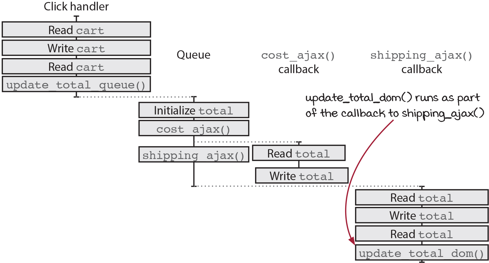
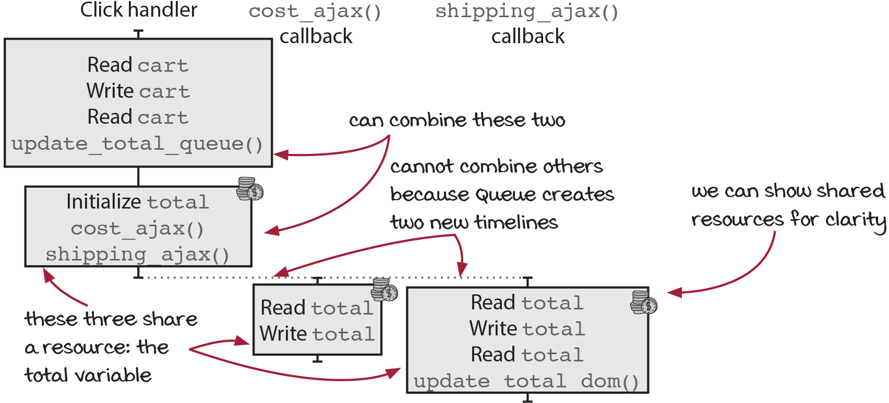
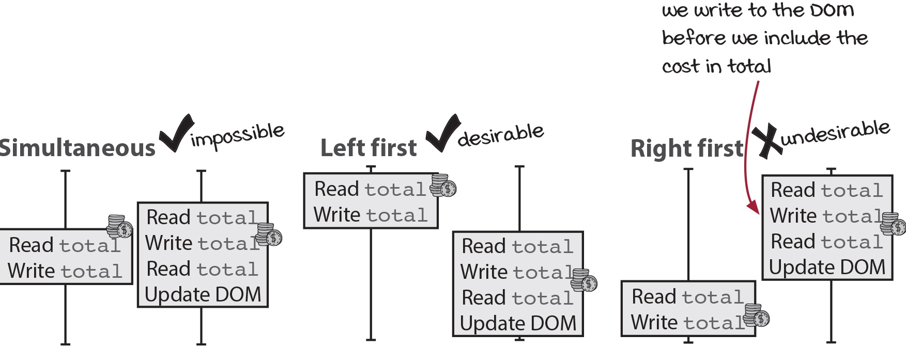

# 타임라인 조율하기

## 최적화 요청
장바구니에 대한 속도 개선을 요청해서 기존 코드를 최적화 했습니다.   
   
```ts
// 기존 코드
function calc_cart_total(cart, callback) {
  var total = 0;
  cost_ajax(cart, function(cost) {
    total += cost;
    shipping_ajax(cart, function(shipping) {
      total += shipping;
      callback(total);
    });
  });
}

// 개선한 코드
function calc_cart_total(cart, callback) {
  var total = 0;
  cost_ajax(cart, function(cost) {
    total += cost;
  });
  shipping_ajax(cart, function(shipping) {
    total += shipping;
    callback(total);
  });
}
```
기존 코드는 cost_ajax 함수 실행이 끝나고 콜백이 호출되면 shipping_ajax 함수 실행을 기다려야 됐었음   
cost_ajax가 3초 걸린다고 가정하고   
shipping_ajax가 4초 걸린다고 가정하면   
7초가 걸린다고 할 수 있음   
   
개선한 코드는
cost_ajax와 shipping_ajax를 함께 호출하기 때문에   
4초만에 두개의 작업을 처리할 수 있음

## 버그 발생
간혹가다가 배송비만 표시되는 경우가 발생   
간헐적인걸 보니 타이밍 문제

### 타임라인 다이어그램을 그리기
1. 액션을 확인하기

    ```ts
    function add_item_to_cart(item) {
      cart = add_item(cart, item); // 1. cart 읽기, 2. cart 쓰기
      update_total_queue(cart); // 3. cart 읽기, 4. update_total_queue() 함수 호출하기
    }

    function calc_cart_total(cart, callback) { 
      let total = 0; // ⭐️ 5. total 0으로 초기화
      cost_ajax(cart, function(cost) { // 6. cost_ajax() 함수 호출하기
        total += cost; // ⭐️ 7. total 읽기, 8. total 쓰기
      });
      shipping_ajax(cart, function(shipping) { // 9. shipping_ajax() 함수 호출하기
        total += shipping; // ⭐️ 10. total 읽기, 11. total 쓰기
        callback(total); // ⭐️ 12. total 읽기
      });
    }

    function calc_cart_worker(cart, done) {
      calc_cart_total(cart, function(total) {
        update_total_dom(total); // 13. update_total_dom() 함수 호출
        done(total);
      });
    }

    const update_total_queue = DroppingQueue(1, calc_cart_worker);
    ```
    total은 지역변수라 타임라인에서 제외했었지만, 현재는 여러 타임라인에서 사용하기 때문에 안전하게 공유되는지 확신이 없다.   
    그래서 total을 다이어그램에 포함   

    > ❓ 지역변수인 total을 액션으로 추가해야 한다 라고 알아채기가 쉽지 않을것 같네요.   
    > 여러 타임라인에서 사용하면 지역변수라도 액션으로 보고 추가해야 된다 라고 생각하고 조심해야 겠습니다.

2. 각 액션을 그리기

    
   
    클릭핸들러와 큐, cost_ajax() 콜백, shipping_ajax() 콜백 으로 나뉨   
   
3. 단순화하기
    
    단순화하기 2단계   
    
    1. 액션을 통합한다.
    2. 타임라인을 통합한다.
       
    
   
큐가 하나로 합쳐지면서 cost_ajax() 콜백이 뒤로 이동

### 실행 가능한 순서 분석하기



동시에는 싱글스레드 특성상 불가능 하고   
UpdateDom이 있기 때문에 왼쪽이 먼저 실행하는건 기대한 결과이며,   
오른쪽이 먼저 실행되는건 기대하지 않은 결과가 됨   
    
**cost_ajax가 먼저 실행되도 가끔 늦는 이유**
1. 응답의 크기가 커서 다운로드 하는데 시간이 오래걸릴수 있음
2. shipping_ajax를 처리하는 서버보다 더 많은 요청을 처리할수도 있음
3. 인터넷 환경의 영향을 받을 수 있음
그 밖에도 여러 원인이 있을 수 있음


### 모든 병렬 콜백 기다리기


cost_ajax() 함수나, shipping_ajax() 함수에 있는 total 읽고 쓰기는 동시에 실행해도 상관이 없음   
두개가 모두 실행되었을때 update_total_dom() 을 부르면 되기 때문   
   
그래서 두개는 동시에 실행(빠른 실행속도를 위해)하고 둘다 끝나면 dom을 수정해주는게 우리가 원하는 타임라인(오른쪽)   
이렇게 두 콜백이 끝나기 기다리는 점선을 `컷(Cut)`라고 함    
   
컷을 만들면 좋은 점은 컷 앞에 있는 타임라인과 컷 뒤에 있는 타임라인을 따로 분석하는게 가능

```ts
function Cut(num, callback) {
  let num_finished = 0; 
  return function() {
    num_finished += 1;
    if(num_finished === num) // done의 호출횟수랑 기다리고 싶은 횟수랑 맞을때만 콜백 실행
      callback();
  };
}

const done = Cut(3, function() {
  console.log("3 timelines are finished");
});
  
done();
done();
done(); // 여기만 실행
```
반환한 함수가 지정한 횟수만큼 호출되어야만 전달한 콜백을 실행   
cost_ajax(), shipping_ajax() 두개의 함수가 호출 되었을때   
update_total_dom()을 콜백으로 전달해서 호출할 수 있음   
   
적용한 모습
```ts
function calc_cart_total(cart, callback) {
  let total = 0;
  const done = Cut(2, function() {
    callback(total);
  });
  cost_ajax(cart, function(cost) {
    total += cost;
    done();
  });
  shipping_ajax(cart, function(shipping) {
    total += shipping;
    done();
  });
}
```
두개의 ajax 함수는 어떤 순서로 실행되도 상관 없음

## 딱 한번만 호출하는 기본형

누군가 제품을 장바구니에 처음 추가했을때만 메세지를 보내려고 하는 상황

```ts
function sendAddToCartText(number) {
  sendTextAjax(number, "Thanks for adding something to your cart. Reply if you have any questions!");
}

function JustOnce(action) {
  let alreadyCalled = false;
  return function(a, b, c) {
    if(alreadyCalled) return;
    alreadyCalled = true; // 처음에 true로 바뀌면 그 다음부터는 위에서 계속 리턴됨
    return action(a, b, c);
  };
}

const sendAddToCartTextOnce = JustOnce(sendAddToCartText);

sendAddToCartTextOnce("555-555-5555-55");
sendAddToCartTextOnce("555-555-5555-55");
sendAddToCartTextOnce("555-555-5555-55");
sendAddToCartTextOnce("555-555-5555-55");
```

## 자바스크립트 시간모델

1. 순차적 구문은 순서대로 실행됨
2. 두 타임라인에 있는 단계는 왼쪽 먼저 실행되거나, 오른쪽 먼저 실행될 수 있음
3. 비동기 이벤트는 새로운 타임라인에서 실행됨
4. 액션은 호출할 때마다 실행됨

## 우리가 만든 동시성 기본형의 종류
1. Queue()
2. Cut()
3. JustOnce()
4. DroppingQueue()