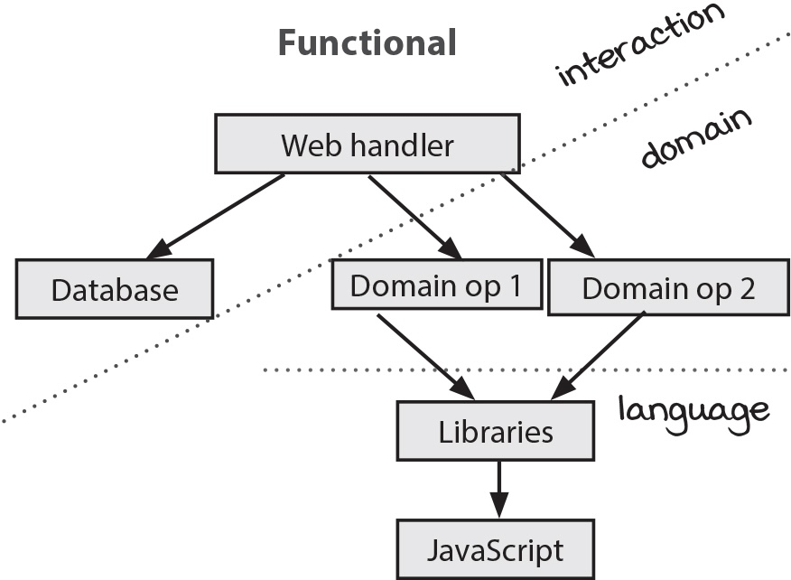

# 반응형 아키텍처와 어니언 아키텍처

**반응형 아키텍처**   
코드에 나타난 순차적 액션의 순서를 뒤집음   
   
**어니언 아키텍처**   
웹 서비스나 온도 조절 장치 같은 현실 세계와 상호작용하기 위한 서비스 구조를 만듬   

## 변경에 대한 원인과 효과가 강력하게 결합되어 있음

장바구니를 바꾸면 장바구니를 표시하는 곳이 바뀌어야 됨   

### 반응형 아키텍처를 사용해서 원인과 효과를 분리

반응형 아키텍처는 이벤트에 대한 반응으로 일어날 일을 지정함   
ex) 순서대로 함수를 호출하는것이 아닌, 바톤 터치 하듯이 A가 실행하고 나면 B를 호출하고 B가 실행되면 C를 호출하는 방식   
   
반응형 아키텍처의 절충점   
1. 원인과 효과가 결합한 것을 분리
2. 여러 단계를 파이프라인으로 처리
3. 타임라인을 유연하게 만듬

일급 상태인 셀을 만듬   
(스프레드시트에서 셀이란 이름을 가져왔는데 셀값을 하나 바꾸면 그에 대한 반응으로 함수를 다시 계산)
```ts
// getter와 setter 같네요
function ValueCell(initialValue) {
  let currentValue = initialValue;
  return {
    val: function() {
      return currentValue;
    },
    update: function(f) {
      const oldValue = currentValue;
      const newValue = f(oldValue);
      currentValue = newValue;
    }
  };
}

// 기존 코드
let shopping_cart = {};
function add_item_to_cart(name, price) {
  let item = make_cart_item(name, price);
  shopping_cart = add_item(shopping_cart, item); // cart값을 읽고 add_item으로 변경하고 shopping_cart에 다시 씀
  let total = calc_total(shopping_cart);
  set_cart_total_dom(total);
  update_shipping_icons(shopping_cart);
  update_tax_dom(total);
}

// 개선 코드
const shopping_cart = ValueCell({});
function add_item_to_cart(name, price) {
  const item = make_cart_item(name, price);
  shopping_cart.update(function(cart) { // 값이 어떻게 변하는지만(add_item) 지정
    return add_item(cart, item);
  });
  const total = calc_total(shopping_cart.val());
  set_cart_total_dom(total);
  update_shipping_icons(shopping_cart.val());
  update_tax_dom(total);
}
```
읽고 변경하고 쓰는 코드에서 변경하는 코드로 변경   
   
**값이 변경될때마다 호출되는 함수 추가**   
```ts
function ValueCell(initialValue) {
  let currentValue = initialValue;
  const watchers = [];
  return {
    val: function() {
      return currentValue;
    },
    update: function(f) {
      const oldValue = currentValue;
      const newValue = f(oldValue);
      if(oldValue !== newValue) {
        currentValue = newValue;
        forEach(watchers, function(watcher) {
          watcher(newValue); // 2. 추가한 함수 호출
        });
      }
    },
    addWatcher: function(f) { // 1. 변경 감지해서 호출할 함수 추가
      watchers.push(f);
    }
  };
}
```
watcher로 값이 변경될때마다 할 동작을 지정할 수 있음


```ts
const shopping_cart = ValueCell({});

function add_item_to_cart(name, price) {
  const item = make_cart_item(name, price);
  shopping_cart.update(function(cart) {
    return add_item(cart, item); // 값을 업데이트하는 원인
  });
  const total = calc_total(shopping_cart.val());
  set_cart_total_dom(total);
  update_tax_dom(total);
}

shopping_cart.addWatcher(update_shipping_icons); // 값이 변경되서 업데이트 되는 "효과"
```
원인과 효과를 분리


```ts
function FormulaCell(upstreamCell, f) {
  const myCell = ValueCell(f(upstreamCell.val())); 
  upstreamCell.addWatcher(function(newUpstreamValue) {
    myCell.update(function(currentValue) {
      return f(newUpstreamValue);
    });
  });
  return {
    val: myCell.val,
    addWatcher: myCell.addWatcher
  };
}

const shopping_cart = ValueCell({});
const cart_total = FormulaCell(shopping_cart, calc_total); // shopping_cart가 바뀌면 같이 업데이트 됨

function add_item_to_cart(name, price) {
  const item = make_cart_item(name, price);
  shopping_cart.update(function(cart) {
    return add_item(cart, item);
  });
}

shopping_cart.addWatcher(update_shipping_icons); // shopping_cart 값이 바뀌면 호출 (효과)
cart_total.addWatcher(set_cart_total_dom); // shopping_cart 값이 바뀌고 호출될때 cart_total도 바뀌면서 호출 (효과)
cart_total.addWatcher(update_tax_dom); // 위랑 같음 (효과)
```
핸들러는 더 작아지고, shopping_cart가 업데이트 되면 분리되어 있는 3가지의 효과가 발생   
셀은 변경할 수 있지만 변경 불가능한 변수에 값을 담아두기 때문에 전역변수보다 안전   
현재 값을 항상 올바르게 유지할수 있는 이유는 계산을 넘기기 때문   
   
## 원인과 효과가 결합한 것을 분리

장바구니가 바뀌는 경우는 많음   
**제품을 추가, 삭제, 비움 등** 여러가지 방법으로 바뀌는데 **항상 배송 아이콘을 갱신**해야 됨   
   
분리해서 배송 아이콘 갱신은 한번만 만들면 됨   
어떤 이유든 장바구니가 바뀔 때 배송 아이콘을 갱신하면 되기 때문

## 여러 단계를 파이프라인으로 처리

어떤 일이 발생하는 여러 단계가 있다면 파이프라인으로 처리하는것이 좋음   
각 단계에서 생성된 데이터는 다음 단계의 입력값으로 사용   
자바스크립트를 사용한다면 Promise로 액션과 계산을 조합해 파이프라인을 구현   
만약 여러 단계가 있지만 데이터를 전달하지 않는다면 이 패턴을 사용하지 않는 것이 좋음

## 타임라인이 유연해짐

순서를 정의하는 방법을 뒤집기 때문에 자연스럽게 타임라인이 작은 부분으로 분리   
공유하는 자원이 없으면 많아져도 문제가 안됨

## 어니언 아키텍처

서비스 전체를 구성하는 데 사용하기 때문에 바깥 세계와 상호작용을 하는 부분을 다룸   
3가지 큰 분류로 나눔   
1. 인터랙션 계층
2. 도메인 계층
3. 언어 계층

어니언 아키텍처는 액션과 계산의 분리, 계층형 설계 방식과 잘 맞음

### 함수형 아키텍처와 어니언 아키텍처는 같은 모양



분리된 점선을 이으면 어니언 아키텍처와 같은 모양이 됨   
그래서 어니언 아키텍처도 인터랙션 계층은 바꾸기 쉬우며,   
도메인 계층을 재사용하기 좋음

### 어니언 아키텍처 규칙

1. 현실 세계와 상호작용은 인터랙션 계층에서 해야 합니다.
2. 계층에서 호출하는 방향은 중심 방향입니다.
3. 계층은 외부에 어떤 계층이 있는지 모릅니다.   
   
**인터렉션 계층에 속하는 코드**   
```ts
// 도메인이 나타나지 않기 때문에 인터렉션 코드
let image = newImageDB.getImage('123');
if(image === undefined)
  image = oldImageDB.getImage('123');

// 이것도 마찬가지로 재요청 하는거지 무슨 도메인을 가르키는게 아니라 인터렉션 코드
function getWithRetries(url, retriesLeft, success, error) {
  if(retriesLeft <= 0)
    error('No more retries');
  ajaxGet(url, success, function(e) {
    getWithRetries(url, retriesLeft - 1, success, error);
  });
}
```
